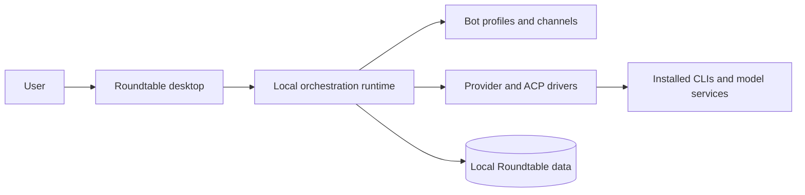

# Roundtable

Roundtable is a local-first desktop app for organizing and running a team of AI agents. Each agent can use its own provider, model, instructions, working directory, and avatar, while multi-agent channels let them collaborate with shared context.

## Current capabilities

- Run agents through built-in adapters for **GitHub Copilot CLI**, Claude, Codex, Cursor Agent, OpenCode, Gemini, Grok, Kimi, Qwen, Hermes, Droid, Pi, MiniMax, Antigravity, Box Agent, and OpenAI-compatible endpoints.
- Discover available models and resume provider sessions where supported. GitHub Copilot CLI connects through its ACP server and uses the models available to your Copilot account. Provider availability depends on the corresponding CLI, account, and credentials installed on your computer.
- Create reusable agent profiles with custom avatars, models, instructions, working folders, and provider settings.
- Chat directly with an agent or bring several agents into a channel with shared context, persistent sessions, and coordinated task execution.
- Organize channel work into separate topics. Each topic keeps its own transcript, agent sessions, approvals, artifacts, and project checkpoint.
- Navigate chats and channels from the workspace sidebar and filter conversations. Right-click a direct chat in **Chats** to rename or delete it, mark that specific conversation as unread, edit its agent's profile, or copy its conversation ID. Unread status is saved separately for each chat. Channel/topic menus and the **Tasks** and **Agents** menus retain their existing actions.
- Review tool and permission requests before an agent performs sensitive work, group command activity into readable runs, and inspect files changed during a turn.
- Attach files and images, search local message history, and move efficiently through long conversations with virtualized, progressively loaded transcripts.
- Inspect activity, token usage, tasks, routines, and Team Map relationships.
- Import and export team definitions for repeatable setups.
- Package the desktop app for macOS, Windows, and Ubuntu.

Connected Apps and USB Android control are not part of the current supported product surface.

## Architecture



The Electron renderer talks to a desktop-owned local orchestration process. Provider CLIs run with the current user's permissions, while approval prompts remain the consent boundary for sensitive actions. Application data is stored locally under `~/.Roundtable`.

## Run from source

Requirements:

- Node.js 24 or newer
- pnpm 10.33.0 or a compatible pnpm 10 release
- At least one supported provider CLI or API configuration

```sh
git clone https://github.com/zhml530/Roundtable.git
cd Roundtable
pnpm install --frozen-lockfile
pnpm dev:desktop
```

Use `pnpm dev` when you only need the browser renderer. The complete desktop development path is `pnpm dev:desktop`.

## Validate a change

```sh
pnpm typecheck
pnpm lint
pnpm test
pnpm build
```


Project documentation is also available under [`apps/docs`](apps/docs).

## Downloads and releases

The new repository does not claim continuity with binaries published by the former repository. New Roundtable releases will appear on the [GitHub Releases page](https://github.com/zhml530/Roundtable/releases) after its release workflow and signing configuration have been set up and verified.

Maintainers should read [the release guide](docs/releasing.md) before publishing artifacts.

## Contributing and security

See [CONTRIBUTING.md](CONTRIBUTING.md) before opening a pull request. Report security issues using the process in [SECURITY.md](SECURITY.md), not a public issue.

## License and upstream attribution

Roundtable is distributed under the [Apache License 2.0](LICENSE). Portions are derived from OpenMausBot; the required attribution and the independent-project notice are recorded in [NOTICE](NOTICE).
