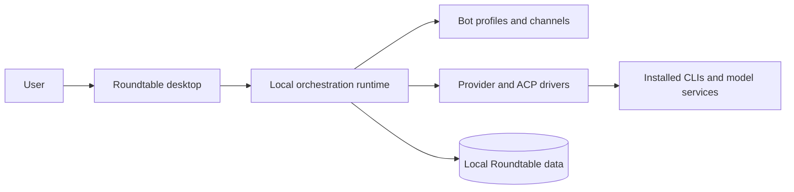

# Roundtable

Roundtable is a local-first desktop app for organizing and running a team of AI bots. Each bot can use its own provider, model, instructions, working directory, and avatar; bots can also collaborate in shared channels.

> [!NOTE]
> Roundtable began as a fork of [OpenMausBot](https://github.com/milind-soni/OpenMausBot). It is now an independently developed project with a different product direction and is not an official OpenMausBot release. The upstream Apache 2.0 license and attribution are preserved in [LICENSE](LICENSE) and [NOTICE](NOTICE).

## Current capabilities

- Create reusable bot profiles with custom avatars, models, instructions, and working folders.
- Chat with one bot or bring several bots into a channel with shared context.
- Review tool and permission requests before an agent performs sensitive work.
- Inspect activity, token usage, tasks, routines, and Team Map relationships.
- Attach files and images to conversations and search local message history.
- Import and export team definitions for repeatable setups.
- Run through built-in adapters for Claude, Codex, GitHub Copilot CLI, Cursor Agent, OpenCode, Gemini, Grok, Kimi, Qwen, Hermes, Droid, Pi, MiniMax, Antigravity, Box Agent, and OpenAI-compatible endpoints. Availability depends on the corresponding CLI, account, and credentials installed on your computer.
- Package the desktop app for macOS, Windows, and Ubuntu.

Connected Apps and USB Android control are not part of the current supported product surface.

## Architecture



The Electron renderer talks to a desktop-owned local orchestration process. Provider CLIs run with the current user's permissions, while approval prompts remain the consent boundary for sensitive actions. Application data is stored locally under `~/.Roundtable`.

## Run from source

Requirements:

- Node.js 24 or newer
- pnpm 10.33.0 or a compatible pnpm 10 release
- At least one supported provider CLI or API configuration

```sh
git clone https://github.com/zhml530/Roundtable.git
cd Roundtable
pnpm install --frozen-lockfile
pnpm dev:desktop
```

Use `pnpm dev` when you only need the browser renderer. The complete desktop development path is `pnpm dev:desktop`.

## Validate a change

```sh
pnpm typecheck
pnpm lint
pnpm test
pnpm build
```

Provider-specific setup:

- [Cursor Agent CLI](docs/cursor.md)
- [OpenCode](docs/opencode-go.md)
- [Ubuntu desktop](docs/linux-desktop.md)

Project documentation is also available under [`apps/docs`](apps/docs).

## Downloads and releases

The new repository does not claim continuity with binaries published by the former repository. New Roundtable releases will appear on the [GitHub Releases page](https://github.com/zhml530/Roundtable/releases) after its release workflow and signing configuration have been set up and verified.

Maintainers should read [the release guide](docs/releasing.md) before publishing artifacts.

## Contributing and security

See [CONTRIBUTING.md](CONTRIBUTING.md) before opening a pull request. Report security issues using the process in [SECURITY.md](SECURITY.md), not a public issue.

## License and upstream attribution

Roundtable is distributed under the [Apache License 2.0](LICENSE). Portions are derived from OpenMausBot; the required attribution and the independent-project notice are recorded in [NOTICE](NOTICE).
