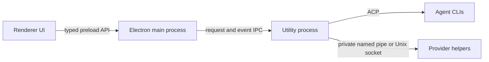

Roundtable does not expose a local HTTP API. Desktop requests cross explicit Electron process boundaries, while agent engines continue to use ACP.

## Network access

Provider CLIs and optional computer services can still make outbound internet requests. Those requests are initiated by the desktop-owned orchestration process or its scoped helpers; they do not require an inbound listener.

## Development UI

Vite serves the renderer during development. This development asset server is not the orchestration transport and is absent from packaged builds, which load UI files directly from disk.

