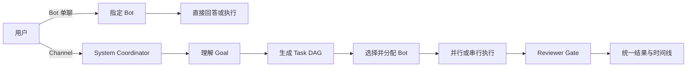
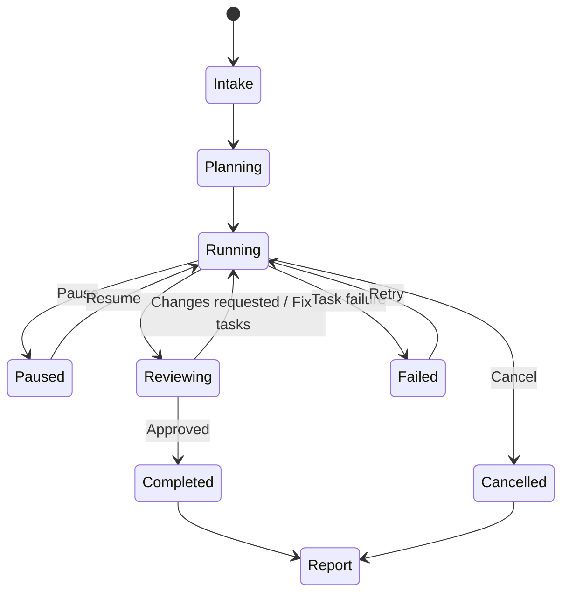

# Roundtable Coordinator 统一设计

更新时间：2026-09-02  
状态：已实现

2026-09-04 更新：Channel 内每个 Bot 使用独立持久会话，回复及审批直接呈现在
Channel；最终交付按“答案 → 支持文件 → 折叠执行详情”排序，执行完成与评审通过
分别记录。实现边界与验证说明见 [Channel conversations](docs/channel-conversations.md)。

## 1. 产品定位

Coordinator 是 Roundtable 的系统级多 Agent 协调控制面，不是某个 Bot、Persona、
Model 或特殊对话。

用户只有两个清晰入口：

- Bot 单聊：让一个指定 Bot 直接工作。
- Channel：把目标交给 Coordinator，由它组织一个或多个 Bot 协作完成。

## 2. Channel 交互模型

Channel 中不再存在：

- Channel Lead。
- Default responder。
- Chief of Staff。
- 独立的 `Build DAG` 输入框。
- `Specific lead / Everyone / Mentions` 路由选项。

Channel 只保留一个 Composer。用户发送的所有普通消息都进入 Coordinator。

Coordinator 根据任务复杂度决定 DAG 大小：

- 简单任务：生成一个 Task，交给一个最合适的 Bot。
- 多步骤任务：生成串行或并行 DAG。
- 高风险任务：增加 Tester、Reviewer 或审批节点。
- 不要求每次调用所有 Bot，只使用必要成员。

## 3. Mention 语义

Channel 中的 Mention 是调度约束，而不是绕过 Coordinator 的聊天路由：

- `@Developer 修复这个问题`：优先把相关 Task 分配给 Developer。
- `@Tester 验证 Windows`：要求 DAG 包含 Tester 的验证任务。
- `@everyone`：要求所有 Channel 成员参与。
- 不使用 Mention：Coordinator 自动选择合适的 Bot。

## 4. Goal → DAG 流程

执行步骤：

1. Coordinator 接收 Channel Goal。
2. 系统级 Coordinator Intelligence 根据 Channel Bot 能力生成任务 DAG。
3. Runtime 解析结构化 Plan proposal。
4. 校验依赖、角色和终态 Reviewer。
5. 将节点分配给合适的 Bot。
6. 每个节点创建独立 Bot Task/thread。
7. Roundtable Runtime 调用现有 Provider/ACP 执行。
8. Tester 独立验证。
9. Reviewer 给出最终 Verdict。
10. Reviewer 否决后，Coordinator Intelligence 提出定向 Replan；Runtime 校验后追加新的 Plan revision。
11. Coordinator 汇总结果并生成执行时间线报告。

Planner 和 Architect 只是本次执行角色，不拥有 Coordinator 权限。

## 5. 权限与运行时边界

Coordinator 负责：

- Run ID 和生命周期。
- DAG 和依赖状态。
- Bot 选择与任务分配。
- Pause、Resume、Retry、Cancel。
- Reviewer/Replan 闭环及修订次数上限。
- 最终结果和时间线报告。

Bot 负责：

- 在自己的 Task/thread 中完成具体工作。
- 使用自己的 Provider、Model、cwd 和工具。
- 遵守自己的 Connected Apps 和审批策略。
- 返回执行结果和证据。

Coordinator 不绕过 Bot 的工具审批、凭据隔离或 Provider 边界。Bot 也不能获得系统
协调权或自行创建团队成员。

## 6. Mission Control

Channel 页面同时承担目标入口和协调控制台：

- 顶部显示当前 Goal 和 Run 状态。
- 中间显示实时 DAG。
- 节点显示角色、Bot、状态、耗时、重试和 Plan revision。
- 点击节点跳转到准确的 Bot Task 对话。
- 提供 Pause、Resume、Retry、Cancel。
- Run 完成后在 Channel 中显示最终报告。
- 报告包含任务结果、失败、审批、Reviewer Verdict 和执行时间线。

## 7. 活跃 Run 中的新消息

目标设计：

- Planning 阶段：新消息作为补充约束，触发重新规划。
- Running 阶段：新消息作为 Steering instruction，由 Coordinator 判断是否增加、修改
  或取消 Task。
- Paused 阶段：允许修改目标或 DAG 后再 Resume。
- Completed 阶段：新消息创建新的 Run，并引用上次结果作为上下文。

当前 Runtime 已在初始 DAG 完成后读取结构化任务结果。Coordinator 可以返回
`complete`、`replan` 或 `blocked`；Replan 会追加经过 schema、Bot 归属、依赖、终态
Reviewer、重复计划和任务总量校验的新 revision，保留已完成 receipt，并显式接收所依赖
的证据。Reviewer 否决后的修正由 Coordinator 根据具体 finding 分配给实际 Channel Bot，
不再使用固定的 Developer → Tester → Reviewer 链。活动 Run 中用户新消息会被持久化为
Steering，并在下一个安全边界触发定向 Replan；当前运行中的 Task 不会被中途改写。若消息
在最终总结期间到达，Runtime 会废弃该轮总结，先应用 Steering，再重新总结。

应用重启时不再把活动 Run 直接标记为失败。Runtime 保留同一 Run、Plan revisions、完成的
receipts 和 `(Channel, Bot)` session；重启时正在执行的 Task 会以同一 task/thread 续跑，
并明确要求 Bot 先核对 workspace 或外部状态，再以幂等方式继续。重启前为 Paused 的 Run
仍保持 Paused，直到用户 Resume。

Run 只有在形成可交付答案后才结束。Coordinator 对一个或多个已完成任务生成最终总结；
如果总结调用失败或返回空文本，Runtime 使用已完成任务的实质输出生成确定性答案，不能
只显示“执行完成”或“总结不可用”。

## 8. 数据模型调整

最终需要删除：

- `Group.defaultResponder`。
- Channel lead/setup responder 配置。
- 普通 Channel 的 member/everyone/mentions 路由。
- Package Room 的 `defaultResponder`。
- `group-routing.ts` 中相关默认 Bot 逻辑。

Bot-to-Bot 内部 Channel 可以保留独立的 last-speaker/peer routing，但它属于内部通信
机制，不应暴露为用户可选择的 Channel Lead。

## 9. 最终用户心智

> 单个 Agent 工作，就进入 Bot 单聊。  
> 多 Agent 团队工作，就进入 Channel。  
> Channel 中的一切协作都由 Coordinator 组织。

本设计取代此前“Channel 保留 Default responder”的方案。
