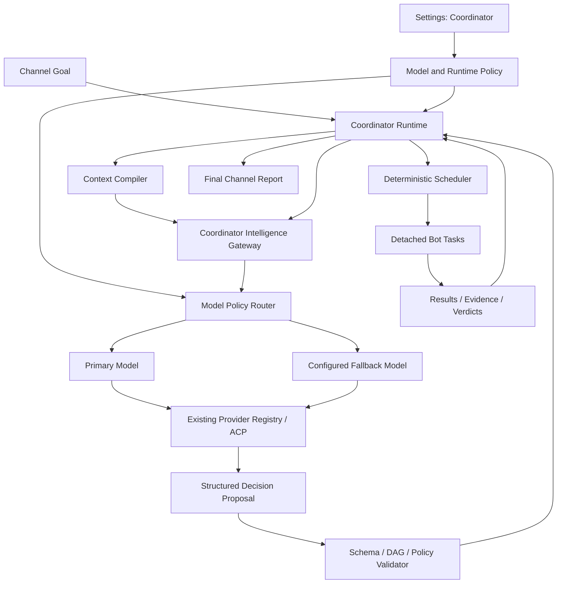
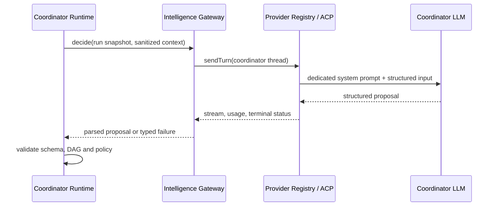
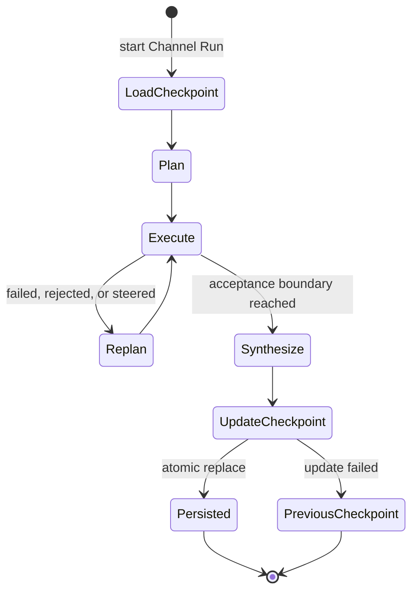
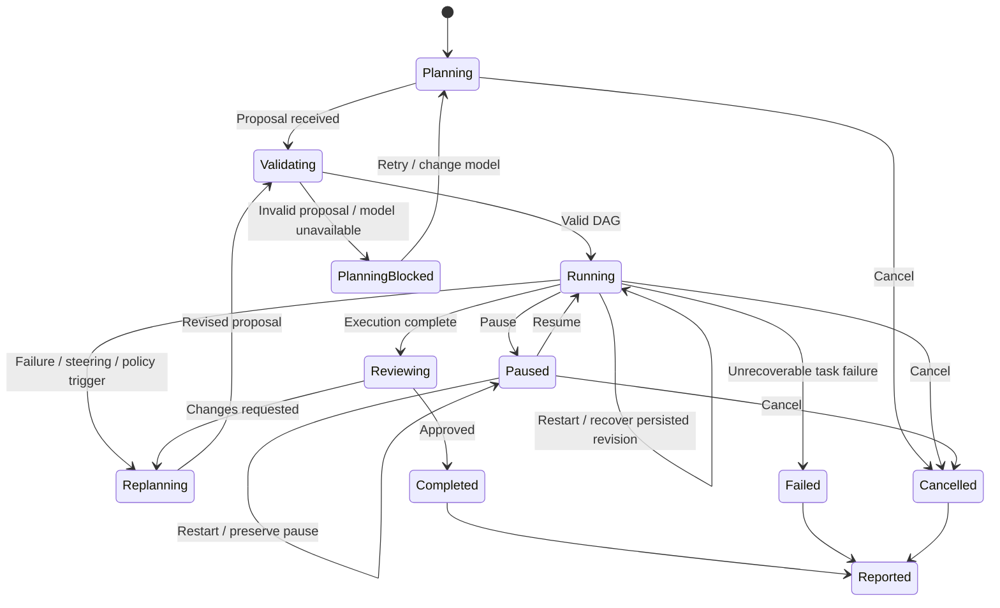

# Roundtable Coordinator Runtime 长期设计

更新时间：2026-09-02  
状态：目标架构设计

## 1. 设计结论

Roundtable 的 Coordinator 必须拆成两个边界清晰的部分：

- **Coordinator Runtime**：确定性的系统控制面，拥有 Run、DAG、调度、审批和状态变更的最终权威。
- **Coordinator Intelligence**：独立的 LLM 决策层，只负责提出 Plan、Replan、分配和总结建议。

Coordinator Intelligence 不复用某个现有 Bot，也不建设第二套 Provider。它使用独立的模型配置、Prompt、Session 和权限边界，同时复用 Roundtable 已有的 Provider Registry、ACP、认证、模型目录、流式事件、Usage 和 Interrupt 能力。

> LLM 负责提出决策，Runtime 负责验证和执行决策。

## 2. 总体架构



## 3. Coordinator Runtime 的权威职责

Runtime 是唯一可以改变协调状态的组件，负责：

- 创建和持久化 Run ID。
- 管理 Run 状态机和版本。
- 保存 Goal、约束、Plan 和 Policy 快照。
- 校验 DAG 无环、依赖存在、任务 ID 唯一和终态条件。
- 根据 Bot 可用性、Mention 约束和 Policy 绑定任务。
- 控制最大并发、超时、取消和重试。
- 创建独立 Bot Task/thread 并收集 receipt。
- 执行 Pause、Resume、Retry、Cancel 和 Replan。
- 强制 Reviewer、审批和 review-triggered Replan 上限。
- 统计 Coordinator 与 Bot 的 Usage、成本和耗时。
- 生成可审计的事件时间线和最终报告。

以下决策不能由 LLM 直接执行：

- 修改 Run 状态。
- 启动、停止或删除 Bot Task。
- 绕过工具审批。
- 提升 Bot 权限。
- 改变凭据或 Provider 配置。
- 超过并发、成本、重试或 Replan 上限。
- 将未校验的文本直接解释为可执行 DAG。

## 4. Coordinator Intelligence 的职责

Coordinator Intelligence 是 Runtime 的无工具推理依赖，负责：

- 判断 Goal 是单任务还是多任务。
- 生成最小且足够安全的 DAG 建议。
- 根据 Bot 能力摘要提出任务分配。
- 解释 Mention 和用户约束。
- 在任务失败、Reviewer 否决或用户 Steering 后提出 Replan。
- 根据结构化 receipts 生成最终总结草稿。
- 说明规划理由、风险和仍需人工确认的边界。

Coordinator Intelligence 不拥有：

- Bot Persona 或 Bot 身份。
- Bot 对话历史和 resume cursor。
- cwd、文件、Terminal 或 Computer。
- Connected Apps、Composio 或 Agent MCP。
- 创建 Bot、批准工具或修改 Runtime Policy 的权限。
- Reviewer 的独立验证权。

Architect、Developer、Tester 和 Reviewer 都是执行角色。Architect 可以成为 DAG 中的任务承担者，但不再默认充当 Coordinator Planner。

## 5. Provider 与 Session 边界

Coordinator 使用已有 Provider Registry 获取真实 Provider 和模型目录：



每次调用必须满足：

- 使用独立线程，例如 `coordinator:<runId>:planning:<revision>`。
- 使用专用且版本化的 Coordinator system prompt。
- 不传 Bot system prompt、cwd 或 integrations。
- Provider 凭据仍由现有实例和桌面安全存储管理。
- Provider 事件继续进入现有 Runtime Bus，但标记为 Coordinator scope。
- Coordinator usage 与 Bot task usage 分开统计。
- Settings 修改模型只影响后续 Run，不改变活动 Run。

## 6. 模型策略

长期数据模型应表示“策略”，而不是绑定一个永远不变的模型：

```ts
interface CoordinatorModelPolicy {
  primary: ModelSelection;
  fallbacks: ModelSelection[];
  routes?: {
    triage?: ModelSelection;
    planning?: ModelSelection;
    replanning?: ModelSelection;
    synthesis?: ModelSelection;
  };
  failureMode: "pause" | "fallback";
}
```

第一版只需要配置 Primary、一个可选 Backup 和 Reasoning Effort。内部结构保留按操作路由的能力，未来可以让小模型处理复杂度判断、强模型处理复杂规划、低成本模型处理普通总结。

模型路由必须由显式 Policy 决定，不能静默借用 Channel Bot。

## 7. Settings 设计

App Settings 新增独立的 `Coordinator` 页面，位于 `Engines` 和 `Usage` 之间。

### Model

- Primary Engine 和 Model。
- 可选 Backup Engine 和 Model。
- Provider 的 Ready、Sign-in required 或 Unavailable 状态。
- Provider 支持时显示 Reasoning Effort。
- `Test Coordinator`：执行无工具、结构化的规划 smoke test。
- 显示最后测试时间、延迟和结果。

模型选择复用 `/api/instances` 和现有 Model Picker 数据源。API Key、CLI 和登录继续在 Connections/Engines 管理，不在 Coordinator 页面重复配置。

### Policy

- Quality、Balanced、Economy 预设。
- Planning timeout 和 retry。
- 最大并发 Task 数。
- 最大 Fix cycle 数。
- 单次 Run 的 token、成本和时间预算。
- 高风险任务是否强制 Reviewer。
- Primary 失败时 Pause 或使用 Backup。

### Diagnostics

- 当前模型、Prompt 版本和 Policy 版本。
- Planning latency、token 和成本。
- Fallback 次数。
- Plan validation failure。
- Reviewer rejection 和 Fix cycle 指标。

第一版不允许用户编辑 Coordinator system prompt，也不暴露 temperature、top-p 等底层采样参数。

## 8. Run 快照与可审计性

Run 启动时复制不可变配置快照：

```ts
interface CoordinatorRunSnapshot {
  requestedModel: ModelSelection;
  actualModel: ModelSelection;
  modelPolicyVersion: number;
  promptVersion: string;
  runtimePolicyVersion: number;
  planningBudget: {
    timeoutMs: number;
    maxTokens?: number;
    maxCost?: number;
  };
}
```

每个 Plan revision 记录：

- 输入 Goal 和约束摘要。
- 模型、Provider、Prompt 和 Policy 版本。
- 原始结构化 proposal 的安全摘要。
- Validator 接受、修正或拒绝的原因。
- 生成的 DAG 版本和前一版本引用。
- latency、usage、成本和 fallback 原因。

这使运行结果能够重放、比较和离线评估，也避免 Settings 变化影响正在执行的 Run。

## 9. Context Compiler 与安全边界

Runtime 不应把完整 Channel transcript、Bot 输出或系统内部对象直接拼接给 LLM。Context Compiler 只生成完成当前决策所需的最小上下文：

当前实现还会读取 Runtime 自己维护的
`~/.Roundtable/channel-projects/<channel-id>/PROJECT_STATE.md`。每个 Run 的最终答案
产生后，Coordinator 以旧 checkpoint 和本轮持久化证据生成新 checkpoint；Runtime
执行 32 KiB 上限校验并原子替换文件。完整 transcript/receipts 仍是审计真相，摘要只
负责跨长会话恢复“当前项目状态”。



- 当前 Goal 和用户补充约束。
- 可用 Bot 的稳定 ID、名称、能力摘要和状态。
- 当前 DAG、Task 状态和依赖。
- 结构化 receipts、证据位置和 Reviewer verdict。
- 当前 Runtime Policy、预算和审批边界。

Bot 文本、外部网页、文件内容和工具结果一律视为不可信数据，使用明确的数据边界包装，不能覆盖 Coordinator instructions。Secret、原始凭据和无关 transcript 不进入 Coordinator prompt。

## 10. 状态机



状态变更由 Runtime 执行并持久化。LLM 只能返回建议动作，例如 `create_plan`、`revise_plan` 或 `synthesize_report`。

Replan 使用追加式 revision，不覆盖已完成任务和 receipt。Reviewer 否决时，Intelligence
根据具体 finding 选择实际 Channel Bot，Runtime 要求修订以一个终态 Reviewer 结束；任务
失败时，proposal 必须列出被替代的 failed/blocked task ID，且只有替代 revision 全部成功后
Runtime 才将旧失败标记为 recovered。重复 proposal、非法 Bot、依赖环、未解决的失败和超出
review-replan 上限的建议都不能改变 authoritative Run 状态。

## 11. 失败与降级

推荐处理顺序：

1. Primary Model 自动重试一次。
2. Policy 允许时切换到显式配置的 Backup。
3. 对 Backup 输出重新执行完整校验。
4. 仍失败则进入 `PlanningBlocked`。
5. Mission Control 提供 Retry、Change Model 和 Cancel。

自由文本 Goal 不应静默借用某个 Bot，也不应静默使用低质量 deterministic DAG。只有经过版本化和测试的固定 Routine 可以使用模板 DAG 降级，并必须在时间线中显示降级原因。

Provider 配置重载可能终止进行中的 Provider turn，因此 Coordinator 模型选择变更本身不应重建 Provider Fleet；它只更新下一次 Run 使用的 Policy。

## 12. 动态 Replan 与 Steering

活动 Run 中的新消息按以下规则处理：

- Planning：合并补充约束并生成新 Plan revision。
- Running：先判断是补充信息、修改目标、增加任务还是取消任务。
- Paused：允许预览修改后的 DAG，再由用户 Resume。
- Reviewing：用户补充证据可以触发重新验证。
- Completed：创建新 Run，并显式引用上一 Run 的报告和 receipts。

Replan 不能覆盖已完成任务的历史记录。新 DAG 通过 revision 追加，已完成 receipt 只能被复用、标记过期或由新验证任务推翻。

Steering 本身是 Run 中的持久化记录，包含消息 ID、基准 revision、pending/applied/blocked
状态和实际应用 revision。Runtime 只在安全边界调用 Intelligence，不会中途篡改已经 dispatch
的 worker prompt；最终 synthesis 与 Steering 之间有提交栅栏，晚到消息不能被已完成状态越过。

重启恢复同样由 Runtime 控制：已完成 receipt 保持不变，未开始任务重建为剩余 DAG，重启
瞬间正在执行的任务复用原 `(Channel, Bot)` thread 并以恢复提示续跑。恢复提示要求先检查
当前状态再继续，以降低重复副作用风险。Paused 状态跨重启保留；只有 Agent 缺失等确定性
能力缺口才进入 `PlanningBlocked`。

## 13. 可观测性与评估

长期应建立 Coordinator 专用指标：

- Planning 成功率和结构校验失败率。
- Goal 到首个 Task dispatch 的时间。
- 平均 DAG 大小和不必要任务比例。
- Bot 分配变更率。
- Reviewer rejection、Fix cycle 和最终成功率。
- Primary/Backup 使用比例。
- 每个 Run 的 Coordinator 成本与 Bot 执行成本。
- 用户 Pause、Cancel、Retry 和手动修改频率。

使用脱敏的 Run 快照建立离线 eval cases，比较不同模型、Prompt 和 Policy 版本。模型升级必须通过回放评估，而不是只凭单次人工体验替换默认模型。

## 14. 分阶段演进

### Phase 1：独立模型身份

- Settings 增加 Coordinator Primary Model。
- 新增无工具的 Coordinator Intelligence Gateway。
- Run 保存 model、prompt 和 policy snapshot。
- 当前 Bot Planner 仅作为迁移兼容，不再作为目标架构。

### Phase 2：可靠性

- 增加 Backup、typed failure 和 `PlanningBlocked`。
- 增加 token、成本、超时和重试预算。
- 完善 Runtime Validator 和 Coordinator usage。

### Phase 3：动态协调

- 已支持结果驱动的补充任务 revision：读取已完成 receipt，追加经过 Runtime 校验的任务，
  最多三轮，并将依赖证据传给补充任务。
- 已支持活动 Run 中用户消息触发的持久化 Steering，并通过定向 revision 应用修改。
- 已支持应用重启后从持久化 Run/revision、receipts 和 Channel session 继续执行。
- 待支持由 Steering 直接取消或替换尚未 dispatch 的单个任务；当前停止整个 Run 使用 Cancel。
- 待补充 receipt 失效规则；当前已完成 receipt 保持不可变并可作为补充任务证据复用。
- 支持高风险任务的人工 Plan approval。

### Phase 4：策略路由与评估

- 按 triage、planning、replanning、synthesis 路由模型。
- 建立离线 replay/eval 和模型升级门禁。
- 根据任务复杂度、风险、成本和历史效果选择模型。

## 15. 最终边界

长期产品中只有一个 Coordinator 概念：系统级 Coordinator Runtime。

- Coordinator Runtime 拥有控制权，但不负责开放式推理。
- Coordinator Intelligence 提供推理，但不拥有控制权或工具。
- Bot 负责执行，但不能获得系统协调权。
- Provider Registry/ACP 负责模型连接，但不决定业务调度。
- Settings 定义未来 Run 的模型与 Policy，活动 Run 使用不可变快照。

这一结构既避免把系统控制面绑定到某个可编辑、可删除的 Agent，也避免重复建设 Provider，同时允许 Coordinator 从单一模型平滑演进为可评估、可路由、可降级的长期智能控制面。
