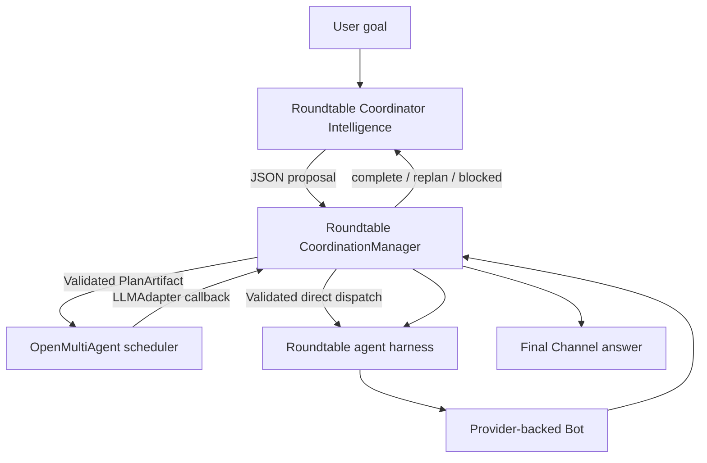

# Coordinator Architecture

## Responsibility Boundary

Roundtable owns the coordination intelligence, governance, persistence, and real agent runtime. OpenMultiAgent (OMA) is embedded as the generic DAG scheduling engine.



### Roundtable Responsibilities

- Build the planning context from the goal, Channel conversation, project state, previous runs, Bot roster, and runtime policy.
- Invoke the Coordinator once for dispatch-or-plan, then use result evaluation,
  synthesis, and project-state checkpoints only on paths that require them.
- Parse, normalize, and validate model-generated plans before execution.
- Bind plan tasks to real Channel Bots.
- Own `CoordinationRun` and `CoordinationTask` state, revisions, steering, review policy, recovery, persistence, and reports.
- Bridge OMA workers to the existing `startTurn` agent harness.
- Own provider sessions, tools, approvals, transcripts, workspaces, model selection, and final Channel delivery.

### OpenMultiAgent Responsibilities

- Consume an already prepared `PlanArtifact`.
- Determine which tasks are runnable from `dependsOn` relationships.
- Dispatch independent tasks with bounded concurrency.
- Block or skip descendants whose dependencies failed.
- Emit task lifecycle events.
- Aggregate task records and outputs into `TeamRunResult`.

OMA does not generate the Roundtable DAG, select Channel Bots, manage provider sessions, decide whether evidence is sufficient, perform replanning, or synthesize the final answer. From Roundtable's perspective, it behaves like an embedded DAG execution library rather than the Coordinator intelligence.

## Planning and Execution

1. A user message in a non-DM Channel starts a `CoordinationRun` when no run is active.
2. Roundtable invokes the configured Coordinator model with `COORDINATOR_SYSTEM_PROMPT`.
3. The model returns either a validated `dispatch` (one bounded low-risk Bot
   assignment) or `plan` containing a complete DAG. There is no separate classifier call.
4. Roundtable parses the proposal into OMA's `PlanArtifact` shape.
5. Runtime validation checks task count, unique IDs, required fields, known dependencies, self-dependencies, and cycles.
6. Roundtable binds every task to an available Channel Bot and ensures explicitly mentioned Bots participate.
7. `OpenMultiAgent.runFromPlan` schedules the validated DAG.
8. Each OMA worker uses `RoundtableAdapter`, which calls `CoordinationManager.invokeTask` and then Roundtable's `runBotTurn`/`startTurn` path.
9. Roundtable evaluates results and chooses `complete`, `replan`, or `blocked`.
10. Completed results are synthesized into the final Channel response and a durable project-state checkpoint.

Steps 4–10 describe the planned path. Direct dispatch instead calls `invokeTask`
through the same worker harness, persists its receipt, and uses the Bot's final
message without OMA scheduling, result evaluation, or synthesis. Pure conversation
skips checkpointing; project work and observed tool use update durable context.
An authenticated `request_planning` control call or pending user Steering can
transition direct work to a validated remaining-work plan with completed-action
evidence. Neither user/tool prose nor response JSON is interpreted as that control.

The central execution boundary is:

```typescript
orchestrator.runFromPlan(team, plan, { abortSignal: signal });
```

`PlanArtifact` is the protocol object between Roundtable's coordination layer and OMA's scheduler. It is not the durable Roundtable run record; `CoordinationRun` and `CoordinationTask` hold the application-specific state.

## Session Model

### Coordinator Model Sessions

Routing, planning, decision, synthesis, and checkpoint calls use independent temporary Roundtable thread IDs:

```text
coordinator:<runId>:<purpose>:<revision>:<uuid>
```

Each call receives the required context explicitly. The Coordinator model does not keep or control the worker provider sessions.

### Worker Bot Sessions

Each task is assigned a Roundtable `threadId`. Roundtable creates or reuses the per-Channel/per-Bot task session through `store.ensureChannelSession(...)`, then dispatches through `startTurn`.

`startTurn` resolves the task's provider-specific resume cursor and sends it to the selected adapter. For ACP providers such as GitHub Copilot CLI, the driver uses that cursor to load or continue the corresponding backend ACP session. The Coordinator and OMA only need the Roundtable `threadId`; they do not pass native provider session IDs in the DAG.

## Result-Driven Replanning

Roundtable invokes Coordinator intelligence again after execution with one of these triggers:

- `task_failed`
- `review_rejected`
- `result_gap`
- `user_steering`

The model proposes a typed decision:

- `complete`: existing evidence satisfies the goal.
- `replan`: append the smallest corrective or follow-up DAG.
- `blocked`: no safe executable plan can make progress.

Roundtable validates every replan, rejects repeated plan fingerprints, limits replan cycles, and only marks failed tasks resolved after their replacement revision completes successfully.

Messages sent while a run is active become steering requests. They are persisted and applied at a safe result-evaluation boundary rather than mutating an in-flight task.

## Persistence and Recovery

Roundtable persists recent runs to `coordination-runs.json`. After a process restart:

- Completed task receipts remain completed.
- Planned tasks that were running become ready again. Interrupted direct workers
  fail closed for inspection instead of replaying potentially irreversible actions.
- Existing task `threadId` values are retained.
- Recovery metadata and an idempotency warning are added to interrupted tasks.
- Execution resumes only after providers, stale approvals, and queued handoffs have been reconciled.
- Completed direct receipts finalize without another worker turn. Final delivery
  enriches the exact projected worker message and is idempotent by Run ID.

Provider processes themselves do not survive the restart. Session continuation is reconstructed through Roundtable's stored task/session bookkeeping and the provider adapter's normal resume mechanism.

## Concise Mental Model

> Roundtable thinks, governs, persists, and executes real Bots. OMA schedules the validated task graph.

- Coordinator intelligence: Roundtable model calls and prompts.
- Coordination governance: `CoordinationManager`.
- DAG scheduling: OpenMultiAgent.
- Agent execution: Roundtable `startTurn` and provider adapters.
- Native session ownership: provider drivers, keyed through Roundtable task threads and resume cursors.

## 聊天总结

### 1. GitHub Copilot CLI 如何识别当前会话

讨论最初从 Copilot ACP driver 的启动参数开始：

```typescript
spawnArgs: (config, turn) => [
    ...(config.fullAuto ? ["--allow-all"] : []),
    ...(turn.model ? ["--model", turn.model] : []),
    "--acp",
]
```

这里的参数只负责启动 `copilot --acp` 进程，并不通过命令行参数传递 session。会话是在进程启动后通过 ACP JSON-RPC 建立和选择的：Runtime 先发送 `initialize`，再发送 `session/new` 或 `session/load`，并在后续请求中携带 ACP `sessionId`。

Roundtable 自身不把原生 ACP session ID 暴露给 Coordinator。它保存任务的 `threadId`，并在 provider 发出 `session.started` 事件后，把原生 session ID 记录为该任务和 provider instance 对应的 resume cursor。后续 `startTurn` 根据 `threadId` 找到任务记录，再决定是否把这个 cursor 作为 `resumeCursor` 传给 provider adapter。

因此存在两层标识：

- Roundtable `threadId`：应用层任务和对话标识。
- Provider session ID / resume cursor：GitHub Copilot CLI 等具体 provider 的原生会话标识。

### 2. 当前 Coordinator 的工作机制

用户在非 DM Channel 中发送目标后，Roundtable 创建 `CoordinationRun`。Coordinator 模型读取目标、Channel 对话、项目状态、历史结果、Bot roster 和运行策略，返回一个 JSON DAG。

这个模型输出不能直接执行。`CoordinationManager` 会解析和校验任务，检查 ID、依赖和环路，将任务绑定到真实 Channel Bot，并按策略补充高风险 Reviewer。通过校验后，计划才以 `PlanArtifact` 形式交给 OMA。

OMA 按依赖和并发限制派发任务。每个 OMA worker 通过 `RoundtableAdapter` 回调 `invokeTask`，最终进入 Roundtable 原有的 `runBotTurn` 和 `startTurn`。因此工具、审批、工作目录、transcript、模型选择和 provider session 都继续由 Roundtable agent harness 管理。

首轮任务结束后，Roundtable 再调用 Coordinator 模型评估结果，并根据 `task_failed`、`review_rejected`、`result_gap` 或 `user_steering` 作出 `complete`、`replan` 或 `blocked` 决定。最后由 Coordinator 模型合成 Channel 回答并更新 durable project state。

### 3. Roundtable 与 OMA 的分工

对话中澄清了一个容易混淆的判断：并不是 Roundtable 只负责 Runtime、OMA 负责 Intelligence。

实际分工是：

- Roundtable Coordinator model calls 负责 Coordination Intelligence，包括规划、结果判断、重规划、总结和 checkpoint。
- `CoordinationManager` 负责 Roundtable 特有的治理，包括校验、Bot 绑定、状态、持久化、steering、review 和恢复。
- OMA 负责通用 DAG execution，包括依赖调度、并发控制、任务生命周期事件和结果聚合。
- Roundtable agent harness 负责真实 Bot 执行以及 provider、session、工具和审批。

所以 OMA 在当前集成中更接近一个嵌入式调度库或工具，而不是自主的 Coordinator Intelligence。

### 4. `PlanArtifact` 的定位

`PlanArtifact` 是 Roundtable 和 OMA 之间的 DAG 协议对象，描述目标、任务和 `dependsOn` 关系。它只承载一次交给 OMA 执行的计划，不是 Roundtable 的完整持久状态。

Roundtable 自己的 `CoordinationRun` 和 `CoordinationTask` 还保存：

- 真实 Bot 绑定和任务 `threadId`
- task status、output、error 和 usage
- plan revision 与 replan trigger
- steering、review 和 decision 记录
- restart recovery 信息
- 最终回答、报告和 project-state checkpoint

### 5. 最终结论

> Roundtable 负责思考、治理、持久化和真实 Agent 执行；OMA 负责运行已经通过 Roundtable 校验的 DAG。

Coordinator 和 OMA 都不直接管理 GitHub Copilot CLI 的原生 ACP session。任务沿 Roundtable `threadId` 进入 `startTurn`，再由 provider adapter 使用保存的 resume cursor 恢复具体后端会话。
