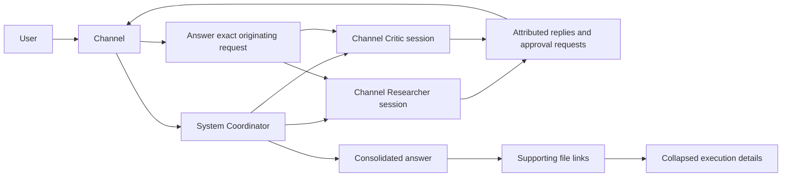

# Channel conversations and delivery

Channels are coordinated by the system Coordinator. Each `(Channel, Bot)` pair
owns a persistent provider session, separate from the Bot's direct chat and its
sessions in other Channels. DAG tasks are assignments within that session, not
new conversations. Up to two independent tasks run concurrently; turns belonging
to the same Bot remain serialized.

## Session and event ownership

- `GroupRecord.memberSessions` maps Bot IDs to existing task thread IDs. Provider
  resume cursors remain on `TaskRecord`, preserving provider/credential isolation.
- Existing Channels lazily adopt their most recent Coordinator task for a Bot.
  No direct-chat session or another Channel's session is adopted.
- Bot messages are persisted in their session and projected into the Channel
  with `from` attribution and `source: { threadId, messageId }`. Updates to tool
  and approval cards update that same projection.
- Streaming is keyed by the original session thread, with one bubble per Bot.
  Approval routing resolves the stored source; duplicate provider request IDs
  in different sessions require the source session ID rather than guessing.
- A turn receives a bounded snapshot of the current Channel conversation at
  dispatch. Planning also receives recent results from that Channel, including
  legacy runs whose worker messages were not shown in the Channel.
- Restart retains session cursors but retires pending provider approval cards.
  Interrupted runs require retry. Removing a member or deleting a Channel cancels
  its active run before detaching sessions. The old task records remain available.

## Approval policy

A user-started Channel run is attended work and honors each Bot's configured Auto
mode and Always allow grants. Destructive/sensitive guards and questions still
reach the user. Webhook/automation turns remain unattended and do not inherit
those grants. Changing Auto mode does not retroactively approve an already-open
request; answer that card explicitly.

## Final delivery

Single-task answers appear once, under the Bot that answered. Multi-task runs
use the system Coordinator model to reconcile final Bot outputs, including fixes
and reviews. Intermediate narration is visible as Bot conversation but excluded
from the final output collected for synthesis.

The answer is followed by supporting files and collapsed execution details.
Documents are discovered within the pinned session workspaces with bounded
scanning; only produced or referenced supported files are listed. Links resolve
through the Channel's stored artifact records, are checked against the real
workspace path, and cannot traverse outside it. Text previews and binary
downloads are limited to 5 MB. Missing files report an error rather than silently
opening a different path.

Execution status and review status are separate. `completed` means execution
finished; review can be `approved`, `changes_requested`, `unresolved`, or
`not_required`. Automatic fix cycles require an implementation request and stop
at the configured limit. Analysis and summary requests report missing future
measurements as limitations and do not start automatic implementation cycles.

If synthesis fails, the Channel explicitly says a consolidated summary is
unavailable and points to the Bot findings, while preserving the error in the
execution details. Cancellation/failure also uses answer-first delivery.

## Verification

The Channel API fixture exercises two real harness/provider sessions with
interleaved replies, identical approval IDs, explicit approval, attended Auto
mode, synthesis, artifact retrieval, and a follow-up that reuses both sessions.
Store tests cover restart, cursor isolation, projection updates, legacy adoption,
and membership removal. Coordinator tests cover scope, fix limits, and separate
execution/review outcomes.
