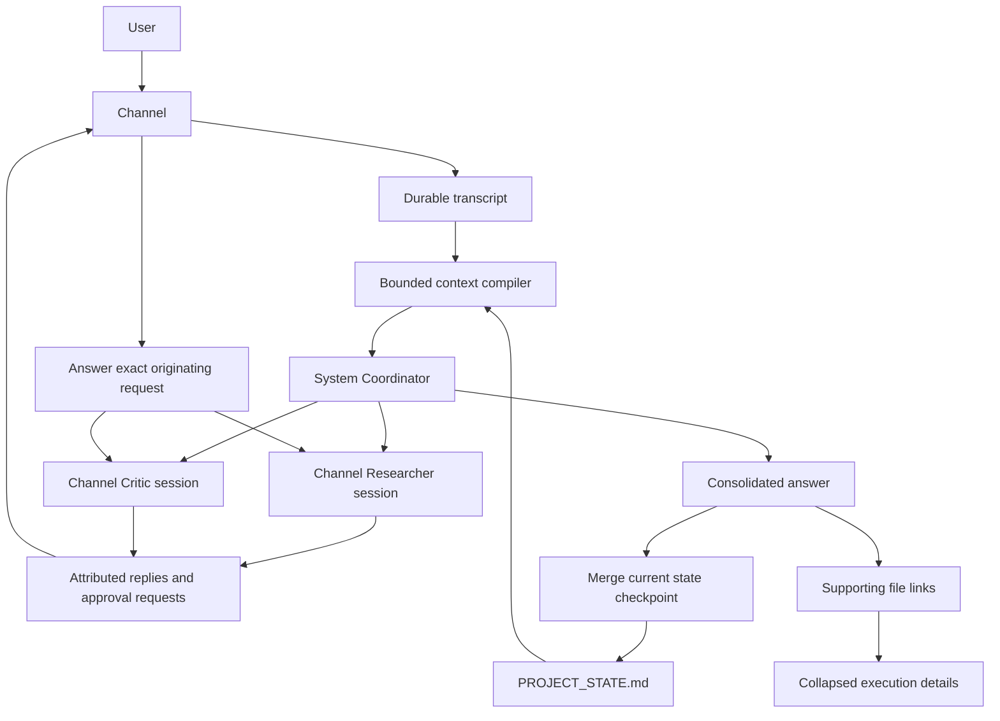

# Channel conversations and delivery

Channels contain Topics, coordinated by the system Coordinator. Each `(Topic, Bot)` pair
owns a persistent provider session, separate from the Bot's direct chat and its
sessions in other Topics or Channels. Direct and DAG tasks are assignments within that session, not
new conversations. Up to two independent tasks run concurrently; turns belonging
to the same Bot remain serialized, including across Topics.

Each Topic also owns a compact project checkpoint at
`~/.Roundtable/channel-projects/<conversation-id>/PROJECT_STATE.md`. This is
Roundtable Runtime state, separate from every Bot's private `MEMORY.md` and from
the user's repository. It survives provider-session loss, model changes, new
Coordinator runs, and application restarts.

## Topics and compatibility

Right-click a Channel and choose **New Topic**, or use its **+** button, visible
on hover, keyboard focus, and touch devices. Both open the same name dialog.
Names must contain 1 to 100 characters after trimming. Successful creation
expands the Channel and selects the new Topic; errors keep the dialog and name
open for retry. **New Channel** continues to create a Channel, not a Topic.
Chats lists Topic names with their owning Channel.

The top-left sidebar button hides or shows the navigation list while keeping
the icon rail available. Choosing Chats or Channels on the rail reopens its
list. Collapsing the list preserves the current search, filter, expanded
Channels, and selected conversation for the current app session.

Every existing Channel conversation appears as **General**. Its conversation ID,
thread, transcript, member sessions, Coordinator receipts, and existing checkpoint
path are unchanged. The legacy root conversation fields back General; additional
`ChannelTopicRecord` entries are persisted in the owning `GroupRecord.topics`
array, not as hidden Channels. Bot-to-bot DMs do not have Topics.

Topics inherit the Channel's current roster, bulletin, context section, setup,
and working-folder policy. They do not copy settings. The first member session
pins the Channel's working folder; existing provider sessions never move.
Transcripts, provider resume cursors, pins, read state, Coordinator runs,
Steering, approvals, artifacts, and project checkpoints remain Topic-local.
Removing a Channel member cancels active runs across its Topics before detaching
that member's sessions. Deleting a Channel removes all its Topic transcripts.

`POST /api/groups/:channelId/topics` creates a Topic. Conversation endpoints keep
their existing `/api/groups/:conversationId/...` shape: General uses the Channel
ID, and additional Topics use their own IDs. Bootstrap and event payloads are
conversation projections carrying `channelId` and `topicName`. Settings resolve
to the owning Channel; read and pin updates resolve only to the addressed Topic.

Planning uses the Channel roster's Bot IDs, names, titles, and full descriptions.
Task roles can describe any specialization, including Researcher and Critic;
execution uses the selected Bot's profile. Ordinary analysis does not acquire an
automatic final review task. The `reviewer` task role denotes an explicit verdict
gate, and high-risk review policy remains enforced. Legacy role-only proposals
require a matching Channel profile; unknown specializations must supply a Bot ID.

## Adaptive dispatch or planning

The first Coordinator call returns one validated outcome, not a classification
followed by another planning call:

- `dispatch`: one concrete available Bot, a bounded task, low risk, no required
  review or dependencies, and a `conversation` or `project` state policy.
- `plan`: the complete remaining-work DAG. Legacy bare task arrays remain
  accepted as plans; persisted runs without `executionMode` retain DAG behavior.

A direct assignment may produce analysis, code, documents, or other bounded work.
Request length and roster size do not determine complexity. Explicit Bot mentions
remain binding; multiple requested Bots, high-risk work, required reviews, and
uncertain/dependent work require a plan. A direct Bot must support the existing
Agents MCP control channel. All normal permissions and approvals still apply.

Direct execution uses the same session and worker harness but bypasses OMA DAG
scheduling, routine result evaluation, and synthesis. The worker's final message
is the answer. Empty output and worker errors fail explicitly. Pure conversation
does not rewrite the project checkpoint. State-bearing assignments, including
observed tool use, checkpoint their durable context without a synthesis call.

If the worker discovers that planning is necessary, it calls `request_planning`
with the active run/task IDs, reason, evidence, completed actions, and remaining
work, then ends its turn. The authenticated internal endpoint validates the
worker/session/assignment and persists the handoff before acknowledging it.
Ordinary user messages, quoted JSON, and tool output are never parsed as control.
The remaining-work plan carries the evidence and no-repeat instructions, preserves
the completed receipt, enforces review policy, and rejects exact repetitions of
completed task IDs, titles, descriptions, or declared actions. These checks do not
prove semantic equivalence between differently worded actions; workers must inspect
actual state before acting. Steering also transitions direct work to a plan at a
safe boundary, rather than mutating the in-flight worker.

## Durable project state

- Planning, synthesis, result-driven replanning, and every Worker assignment
  receive the latest bounded project checkpoint in addition to recent Channel
  conversation.
- After a planned or state-bearing direct Run produces its final answer, Coordinator Intelligence merges the
  previous checkpoint with the latest goal, Steering, task results, artifacts,
  verification, and unresolved issues. Runtime atomically replaces the file.
- The checkpoint is capped at 32 KiB and is always presented as untrusted
  evidence, never as system instructions or execution authority.
- Checkpoint failure does not discard the completed Run or overwrite the last
  good state for planned runs. A state-bearing direct run instead reports failure
  with its completed worker receipt intact, so missing durable context is not
  presented as success. The failure is retained in Run events and metadata.
- Full messages and execution receipts remain the audit log. `PROJECT_STATE.md`
  is the compact continuation context, not a replacement for that history.

## Session and event ownership

- `ChannelTopicRecord.memberSessions` (or `GroupRecord.memberSessions` for General)
  maps Bot IDs to existing task thread IDs. Provider
  resume cursors remain on `TaskRecord`, preserving provider/credential isolation.
- Existing conversations lazily adopt their most recent Coordinator task for a Bot.
  No direct-chat session or another Topic's session is adopted.
- Bot messages are persisted in their session and projected into the Channel
  with `from` attribution and `source: { threadId, messageId }`. Updates to tool
  and approval cards update that same projection.
- Streaming is keyed by the original session thread, with one bubble per Bot.
  Approval routing resolves the stored source; duplicate provider request IDs
  in different sessions require the source session ID rather than guessing.
- A turn receives a bounded snapshot of the current Channel conversation at
  dispatch. Planning also receives recent results from that Channel, including
  legacy runs whose worker messages were not shown in the Channel.
- Restart retains session cursors but retires pending provider approval cards.
  Interrupted direct assignments with unknown outcomes require inspection and an
  explicit retry; they are never automatically replayed. Removing a member or deleting a Channel cancels
  its active run before detaching sessions. The old task records remain available.

## Approval policy

A user-started Channel run is attended work and honors each Bot's configured Auto
mode and Always allow grants. Destructive/sensitive guards and questions still
reach the user. Webhook/automation turns remain unattended and do not inherit
those grants. Changing Auto mode does not retroactively approve an already-open
request; answer that card explicitly.

## Final delivery

Direct answers appear once, under the Bot that answered. The exact projected
source message receives its execution report and stable `coordinationRunId`,
making finalization idempotent across restart. System-owned failure receipts are
also keyed by Run ID. Planned runs use the system Coordinator model to reconcile final Bot outputs, including fixes
and reviews. Intermediate narration is visible as Bot conversation but excluded
from the final output collected for synthesis.

The answer is followed by supporting files and collapsed execution details.
Documents are discovered within the pinned session workspaces with bounded
scanning; only produced or referenced supported files are listed. Links resolve
through the Channel's stored artifact records, are checked against the real
workspace path, and cannot traverse outside it. Text previews and binary
downloads are limited to 5 MB. Missing files report an error rather than silently
opening a different path.

Execution status and review status are separate. `completed` means execution
finished; review can be `approved`, `changes_requested`, `unresolved`, or
`not_required`. Reviewer rejection triggers a typed Coordinator Replan rather
than a fixed role pipeline. Runtime validates the appended revision, requires a
terminal reviewer, rejects repeated plans, and stops at the configured review-
replan limit. Ordinary critique without an explicit reviewer gate does not
start an automatic correction loop. Failed tasks remain failed receipts, but a
successful replacement revision can mark them recovered; unresolved failures
still make the overall Run fail.

An active Channel Run keeps the composer available for Steering. Each Steering
message is persisted against the Run and applied through the same typed,
Runtime-validated revision path; it is never injected into a worker mid-turn.
Application restart reattaches the persisted Run, preserves completed receipts,
rebuilds remaining dependencies, and continues interrupted work on the same
per-Topic Bot session for planned runs. A completed direct receipt can finalize or
continue its persisted planning handoff without repeating its worker; an
interrupted or failed direct worker is not replayed automatically. A paused Run
remains paused across restart.

**Retry finalization** reuses a completed direct receipt to retry only its
checkpoint, delivery, or persisted handoff, not the worker. An uncertain direct
failure cannot use the generic Retry path: inspect its session and external state,
then send a new request describing verified remaining work. Delivery preserves
the already-redacted worker message and scrubs report/system-notice text before
patching it; finalization never restores raw secrets from the worker result.

If synthesis fails, the Channel explicitly says a consolidated summary is
unavailable and points to the Bot findings, while preserving the error in the
execution details. Cancellation/failure also uses answer-first delivery.

## Verification

The Channel API fixture exercises two real harness/provider sessions with
interleaved replies, identical approval IDs, explicit approval, attended Auto
mode, synthesis, artifact retrieval, and a follow-up that reuses both sessions.
Store tests cover Topic restart, cursor isolation, projection updates, legacy
adoption, inherited settings, and membership removal. The API fixture also runs
a second Topic with the same Bots, checks separate sessions and checkpoints,
and verifies artifact access remains conversation-local. Navigation tests cover
the shared creation action, Channel grouping, selection, errors, and worker-session
filtering. Coordinator tests cover scope, fix limits, and separate execution/review
outcomes.
Adaptive tests additionally cover the exact one-routing/one-worker greeting path,
state-bearing checkpoints, structured escalation, steering/cancellation races,
fail-closed direct recovery, idempotent delivery, and direct/routing UI labels.
These checks establish behavior and model-turn counts, not production latency.
