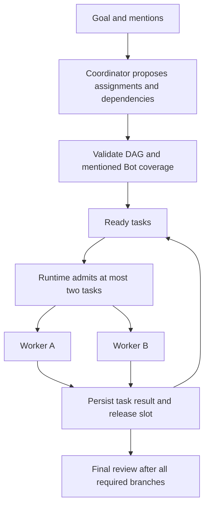

# Coordinator Duo scheduling

Coordinator channels run at most two worker tasks concurrently per channel run.
The Coordinator proposes the task DAG; the runtime enforces dependencies and
the two-task limit. Independent tasks can overlap, and a released slot is
filled without waiting for the other task in the pair. The planning request
precedes worker execution. Other channels have their own limits.



## Planning contract

- Proposals contain `title`, `description`, `role`, `botId`, and optional
  `dependsOn` references to task IDs or titles. Role-only legacy proposals
  remain supported through deterministic Bot binding.
- Coordinator Intelligence decides whether a task must analyze, create or edit
  artifacts, run commands, verify results, or review a deliverable, and writes
  those actions into the task description. Runtime does not classify the
  user's goal with an implementation-keyword list; it validates and schedules
  the resulting DAG while each assigned Bot performs the requested work.
- `@everyone`, `@all`, and individual mentions constrain participation, not
  concurrency. Each requested active Bot must receive a task. Missing
  coverage or an unavailable explicit Bot blocks planning with a reason;
  the runtime does not invent extra work.
- Independent work has no mutual dependency. Real input dependencies and
  overlapping file writes must be described and ordered by the Coordinator.
  This change does not create worktrees or enforce filesystem isolation.
- An existing final review joins all terminal branches; a review gate is
  added for multi-task plans when necessary.

## Execution and receipts

Each task has its own adapter binding and detached conversation. Two tasks
with the same role cannot overwrite each other's execution identity. The same
Bot's turns are serialized, including across managed runs. A Bot waiting for
its previous turn can occupy an admitted slot; distributing independent work
across distinct Bots avoids that bottleneck.

The DAG shows waiting for dependencies, waiting for a slot, running, and
terminal states. Mentioned Bot assignments are listed separately, including
before planning finishes. Task ownership, output, conversation links, and
assignment events are persisted for later inspection.

Pause stops new worker execution. Cancellation stops workers and prevents
queued tasks from starting; a replacement run is rejected until the old run
drains. A failed task blocks its descendants while independent branches can
finish. Failed or blocked work can be replaced by a later revision only when
the Coordinator names the exact task IDs being resolved and every replacement
task succeeds. After results arrive, Coordinator Intelligence may propose a typed
`complete`, `replan`, or `blocked` decision. Replans append a validated plan
revision and preserve completed receipts; they never replace history. A
rejected review must produce one terminal reviewer task, repeated identical
replans are rejected, and Runtime enforces the review-replan limit. Corrective
work is assigned from the actual Channel roster rather than a fixed Developer
→ Tester → Reviewer pipeline. Accepted and rejected decisions remain in the
run audit trail. Coordinated workers cannot use Roundtable
`ask_bot` or `delegate_bot`
to create peer turns outside this scheduler; credential tools retain their
existing behavior. Provider-native internal subagents are outside this
Roundtable worker-task limit.

Messages sent while a Run is active are persisted as Steering. Runtime lets
already-dispatched work reach a safe boundary, then asks Coordinator Intelligence
for a typed decision and appends any accepted work as a new plan revision. A
Steering message arriving during synthesis invalidates that draft answer and is
handled before final completion.

On application restart, active Runs are reattached instead of being converted to
failed Runs. Completed receipts stay immutable, remaining dependencies are rebuilt,
and an interrupted worker reuses its persisted `(Channel, Bot)` thread with an
idempotent recovery instruction. A persisted paused Run remains paused. Recovery
blocks only when its assigned Channel agents no longer exist.

Existing concurrency settings are normalized to 2. Settings presets no longer
change concurrency; single-Bot channels have one effective slot.

## Verification

`server/coordination.test.ts` uses controlled completion gates against the
installed OMA scheduler to verify overlap, immediate slot refill, dependency
ordering and result handoff, a peak of two workers, same-role identity,
mention-all coverage and persistence, same-Bot serialization, failure, and
cancellation, active Steering, synthesis races, and persisted revision recovery.
`server/index.test.ts` verifies the peer-turn guard through the
real harness HTTP API with a fixture provider.

```text
pnpm exec vitest run server/coordination.test.ts server/config.test.ts src/lib/coordination-dag.test.ts
pnpm exec vitest run server/index.test.ts -t "prevents coordinated workers"
pnpm typecheck
```
