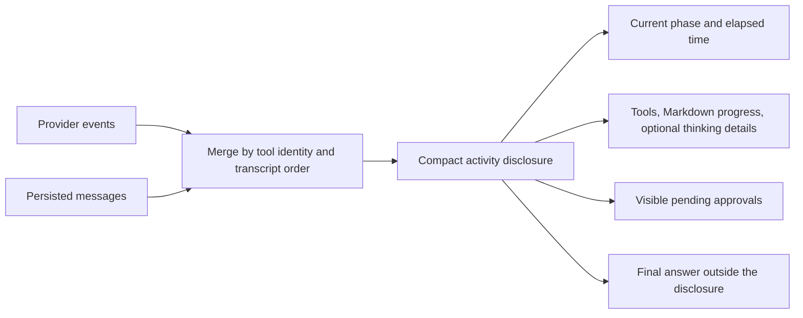

# Codex-inspired direct-chat rendering

Roundtable's normalized provider events drive this design. This is an interaction
design for Roundtable, not a claim of parity with Codex's private desktop UI.

## Implementation

- Default live and historical activity to collapsed. Keep current phase visible.
- Preserve manual expansion across approval and phase updates. Collapse only
  when the turn finishes, unless navigation is focused inside the activity.
- Use one activity component for thinking-only, tool, and drafting states.
- Show parallel tool count and failed action count. Approvals stay outside the
  collapsed body; all outstanding requests remain reachable.
- Settle to a quiet "Worked for Nm Xs" disclosure with a divider beneath it.
  Omit zero minutes for durations under a minute (for example, "Worked for 44s").
  Use persisted timing when available and a transcript estimate for older
  history. Individual outcomes remain inside.
- Render progress notes with Markdown. Show the latest nonempty thinking line
  in the compact status, truncating overflow; full thinking details require
  expansion. Tool, approval, and drafting status still take precedence.
- Preserve persisted tool IDs, hydrated history, transcript tie ordering, and
  message navigation targets. Focus expands the containing activity.
- Keep the final answer outside the activity. A single "Changed file" section
  inside the final answer, above its controls and without a separate divider
  or extra top spacing, lists Added / Changed / Removed paths from successful ACP
  metadata as filename-only hyperlinks to full file URLs (full paths on hover).
  Deduplicate per turn. Hide the section when there are none.
  Reveal the list only after the turn finishes, not while edits are accumulating.
  If there is no final answer, show the list below the turn's activity instead.
  This replaces direct-chat Deliverables and title-based file inference.
  Do not scan the workspace or Git status. File types are not filtered.

## Verification and boundaries

Regression coverage checks hydration, equal timestamps, focus, compact live
states, drafting, and parallel tools. DOM interaction tests also cover approval
updates, manual expansion, completion, Markdown navigation, and opt-in thinking.
Run focused tests, TypeScript, and lint.
Desktop screenshot/scroll validation remains a separate verification step.

Elapsed time currently measures wall-clock time and includes approval waits.
New turns retain start time and completed duration with the transcript. Older
turns estimate elapsed time from the adjacent user prompt to the last turn
message, falling back to the first loaded activity when the prompt is absent.
Reasoning is ephemeral and disappears at completion. Channel rendering remains
separate; this change applies to provider-neutral direct agent conversations.

ACP metadata is accumulated across tool calls, permission requests, and partial
updates. Diff blocks identify additions (null old text) and changes; delete
tools identify removals. Edit/delete locations and explicit input paths are
used when no diff is supplied. Reads, failed/pending tools, prose, and shell
commands without structured diffs do not count. Paths and operations are
persisted on the tool message, not full file contents.
Relative paths in new ACP events are resolved against the turn's working
directory without reading or scanning files. Legacy relative paths without a
known working directory remain plain filenames rather than broken links.
Old transcripts without
this metadata remain empty; Channel artifact discovery is unchanged.
