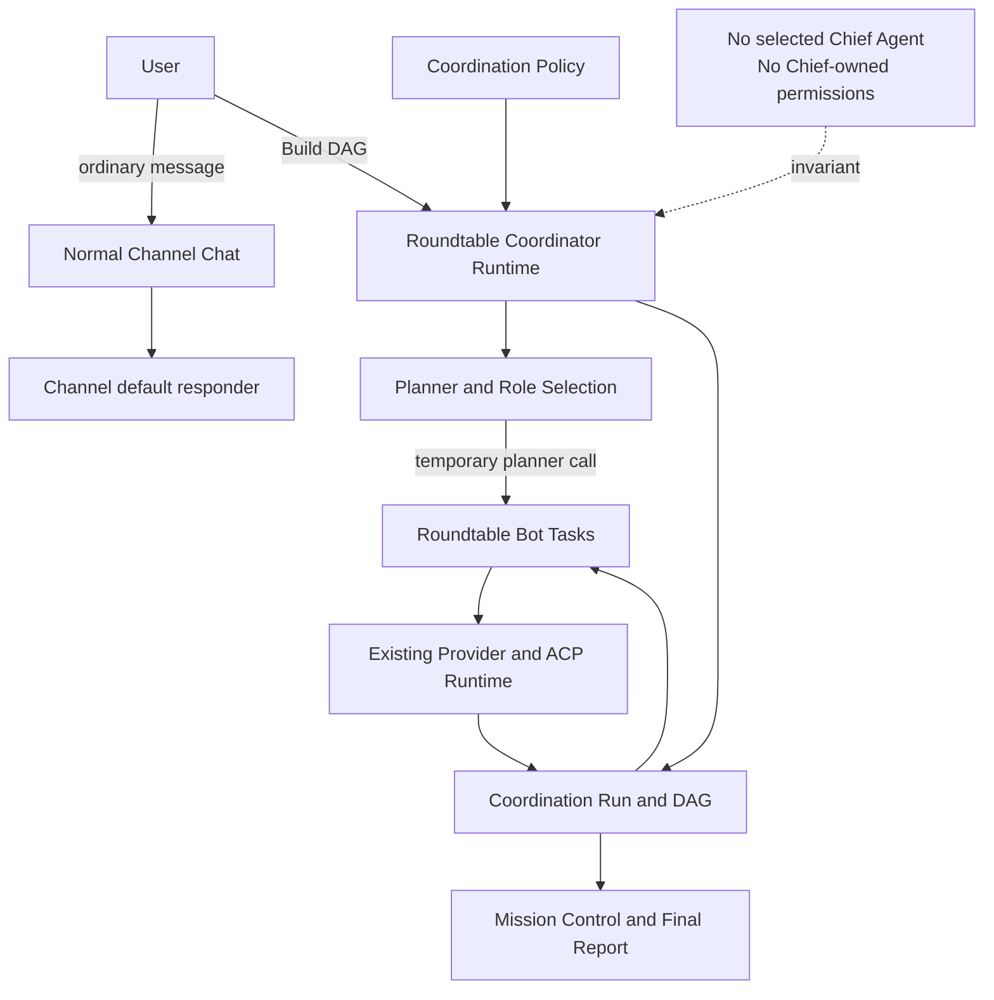
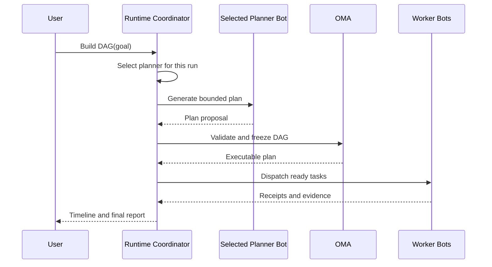
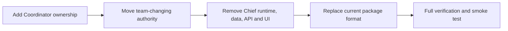

# Coordinator 完整替换 Chief of Staff 实施计划

状态：已实施  
Owner：Roundtable  
目标版本：Coordinator v2  
更新时间：2026-09-01

实施结果：系统级 Coordinator 已成为唯一协调控制面；旧 Bot 领导字段、Prompt、
授权、Agent 创建工具、Package 字段和 UI 已从当前产品与测试中删除。

## 1. 决策

Roundtable 最终只保留一个协调概念：**系统级 Coordinator**。

Chief of Staff 当前是从 Bot 中选出一个 Agent，再通过额外 system prompt 和权限让它
领导其他 Agent。这会形成两层协调模型：Roundtable Coordinator 管理 DAG，而
Chief Agent 又在模型内部管理委派。两者状态、权限和最终结果可能不一致。

替换完成后：

- Coordinator 是 Roundtable Runtime 的能力，不是 Bot、Persona、Model 或 Thread。
- Channel 默认具备 Coordinator 能力，不需要选一个 Agent 当领导。
- Architect、Developer、Tester、Reviewer 和 Planner 都是可替换的执行 Bot。
- Coordinator 可以调用一个 Bot 生成 Plan，但该 Bot 只是本次 Run 的 Planner，
  不拥有 Run 状态、调度权、审批权或最终解释权。
- Section 只负责 Sidebar 组织和共享 Context，不再拥有 Section Chief。
- 普通 Channel 聊天继续使用 `defaultResponder`；它与 Coordinator 是两个概念。
- `ask_bot` / `delegate_bot` 继续作为 Bot 的点对点协作工具，但不构成系统调度权。
- Agent 不再有权通过 Chief 身份创建 Bot；团队变更必须由 Coordinator 的显式用户
  流程完成，并且默认需要用户确认。

## 2. 目标架构



## 3. 当前 Chief 职责与替代归属

| 当前职责 | 当前实现 | 替换后的归属 |
| --- | --- | --- |
| Section 主联系人 | `chiefOfStaff` Bot 字段 | 删除；普通聊天由 Channel `defaultResponder` 决定 |
| 读取团队名单 | Chief system prompt + `list_bots` | Bot 的普通 peer tool；Coordinator 直接读取 Store |
| 同步询问成员 | `ask_bot` | 保留为任意兼容 Bot 的 peer collaboration |
| 异步委派 | `delegate_bot` | 保留为 Bot 间协作；正式任务由 Coordinator DAG 分发 |
| 创建 Specialist | Chief-only `create_bot` | 移出 Agent MCP；改为用户确认的 Coordinator Team Builder |
| 汇总结果 | Chief Agent 自行生成 | Coordinator 从结构化 Task receipt 生成报告/调用独立 Synthesis Bot |
| 冲突解决 | Chief prompt 约定 | Coordinator 状态机、Plan Revision、Reviewer/Fix 流程 |
| Section 唯一性 | `Store.setChiefOfStaff()` | 删除，不再需要唯一领导者约束 |
| 不能归档 Chief | Sidebar/API 保护 | 删除；只保护最后一个可见 Bot和正在执行的 Bot |
| Team Package leader | `package.chiefOfStaff` | 直接改为 `Coordination` 描述；不指定领导 Agent |
| Team Map 皇冠/分组 | `chiefs` / `members` | 按 Section、Role、Run activity 展示，不区分 Chief |

## 4. Coordinator v2 数据模型

### 4.1 BotRecord

从服务端和客户端 Bot 类型中删除：

```ts
chiefOfStaff?: boolean
```

不增加 `coordinator: true` 或 `defaultCoordinatorBotId`。否则只是把 Chief 换了名字，
仍然是从 Agent 中选领导。

### 4.2 Group / Channel

每个非 DM Channel 默认支持系统 Coordinator。可选持久化 Policy：

```ts
interface CoordinationPolicy {
  enabled: boolean;
  plannerStrategy: "auto";
  maxConcurrency: number;
  maxFixCycles: number;
  requirePlanApproval: boolean;
}
```

第一版不允许 `plannerBotId` 成为长期领导者。每次 Run 只快照实际选中的
`plannerBotId`，用于审计和复现。

### 4.3 CoordinationRun

增加或明确以下字段：

```ts
interface CoordinationRun {
  plannerBotId: string;
  plannerBotName: string;
  plannerSelectionReason: string;
  synthesisBotId?: string;
  policySnapshot: CoordinationPolicy;
}
```

Run 的 owner 始终是 Runtime Coordinator，而不是这些 Bot。

## 5. Planner 与角色选择

当前 MVP 默认让 Architect 同时负责规划。替换 Chief 后应显式拆分：

1. Coordinator 读取 Channel 成员、可用状态、Title、Description、模型和能力。
2. `selectPlannerBot()` 优先匹配 Planner / Architect / Tech Lead 能力。
3. Planner 不可用时选择另一个可用成员，并记录选择原因。
4. Planner 只产生 Plan Artifact，不直接启动下游 Bot。
5. Coordinator 验证 DAG、绑定角色、持久化后才允许执行。
6. Architect 仍可以接 Architecture Task，但不因规划调用而获得协调权限。



## 6. 权限边界

### 保留

- Provider/ACP 仍只由 `server/index.ts` 和现有 Driver 管理。
- 每个 Bot 保留自己的工具、Connected Apps、电脑、cwd 和审批策略。
- `approvePeerComms` 继续控制 Bot 是否可以未经询问联系另一个 Bot。
- `ask_bot` 和 `delegate_bot` 仍受 Section、深度、忙碌状态和审批限制。

### 删除

- `chiefOfStaff` 不再影响 system prompt 或工具可见性。
- `/api/internal/create-bot` 不再通过发送方 Bot 的 Chief 标记授权。
- Agent MCP 中删除 `create_bot`，防止某个普通 Agent 自行改变团队结构。

### 新增

- Team Builder 是 Coordinator 的控制面操作，不是模型工具默认权限。
- Coordinator 可提出缺少角色并生成 Bot Profile 草案。
- 只有用户确认后，服务端才创建 Bot；新 Bot 继续默认：
  `composio: false`、`autoApprove: false`、`approvePeerComms: false`。
- 正式 DAG 调度不依赖 Agent 自己调用 `delegate_bot`；Coordinator 直接通过已有
  `startTurn` 边界执行对应 Bot Task。

## 7. 开发期直接切换策略

项目尚未发布稳定格式，本次采用 **一次 breaking change**：不做双写、不保留旧
Package reader、不提供 `chiefOfStaff` 废弃期，也不维护新旧桌面客户端交错兼容。

### 7.1 bots.json

- 从 Bot schema、Store 和写盘格式中直接删除 `chiefOfStaff`。
- 已存在的 Bot 记录仍保留 name、title、description、model 和会话；只丢弃 Chief
  身份，不编写专用 Chief 迁移器。
- 旧 JSON 中多余的 `chiefOfStaff` 属性读取后不进入领域模型，并在下次正常写盘时消失。
- 不把旧 Chief 自动映射成 Planner 或 Default Responder；若它原本就是 Channel 的
  `defaultResponder`，只继续以普通 Bot 身份响应。

### 7.2 Bot Profile API

- 直接从 request、response 和 shared types 删除 `chiefOfStaff`。
- 客户端与服务端在同一提交同步修改，不提供旧客户端兼容分支。
- 若更新 API 对未知字段执行严格校验，旧请求应返回 `400`；不能静默恢复 Chief
  语义。

### 7.3 Bot Package / BotMRR

- 直接修改当前 Package schema、renderer、parser 和 exporter，删除
  `package.chiefOfStaff`。
- Markdown 将 `## Chief of Staff` 改为 `## Coordination`，声明协调由宿主 Runtime
  提供，Agent 只声明角色和边界。
- 不新增 v1 adapter 或 v2 双格式层；现存旧 Package、fixtures 和示例全部重写，旧
  Chief Package 明确视为不支持。
- Import Preview、Team Library 与安装结果文案同步移除 “Chief leads”。

### 7.4 Team Manifest

- 继续坚持 Persona-only 导入。
- 更新注释、文档和测试，删除全部 `chiefOfStaff` 特殊字段处理。

## 8. 分阶段实施

### Phase 0：锁定行为与回归基线

- 为当前 Chief 行为补一份删除清单和测试映射。
- 为 Coordinator v2 写目标 contract 测试。
- 单独记录当前无关的 TTS、peer-comms transport 与 health 测试基线，避免把它们
  误判为本次迁移回归。

验收：新增测试能证明 Coordinator 不依赖任何 `chiefOfStaff` 标记。

### Phase 1：Coordinator 不再由 Architect 持有

- 每次 Run 自动匹配 Architect，且 `CoordinationRun.roles` 快照本次角色分工。
- Architect 的 Planning Task 在 Mission Control 中明确标成 Planning phase，而不是
  Coordinator 本体。
- 最终报告由 Runtime 汇总；需要语言润色时调用独立 Synthesis Bot。

验收：更换本次 Architect 不改变 Run ID、DAG owner、控制按钮或报告归属。

### Phase 2：迁移团队创建与委派权限

- 从 `agents-proxy` 删除 `create_bot` 工具。
- 删除 `/api/internal/create-bot` 的 Chief 授权路径。
- 增加用户确认的 Coordinator Team Builder API/UI，或在该功能完成前保持
  “缺少四个角色则明确报错”的当前行为。
- 保留 `list_bots`、`ask_bot`、`delegate_bot` 和 `approvePeerComms`。

验收：任何 Bot 都不能仅靠 Prompt 自行扩充团队；用户仍可显式创建 Bot。

### Phase 3：一次性切换数据模型与 Package 格式

- 从 Bot schema、Store、wire shape、Bot Profile API 和 patch queue 删除字段。
- 同一提交修改 Bot Package/BotMRR schema、renderer、parser 和 exporter。
- 重写示例、Team Library、导入预览和 package tests，不保留旧 parser/adapter。
- 读取现有 Bot 数据时保留 Bot Profile 与会话，但忽略并清除旧 Chief 身份。
- 旧 Chief Package 直接拒绝导入，并返回当前格式不支持该字段的明确错误。

验收：新写盘与新导出均无 Chief；旧包不再支持；现有 Bot 和会话数据不因删除身份
字段而丢失。

### Phase 4：删除 Runtime Chief 行为

- 从 `startTurn()` 删除 `chiefOfStaffSystemPrompt()` 注入。
- 删除 `server/chief-of-staff.ts` 及其测试。
- 删除 `Store.setChiefOfStaff()` 和每 Section 唯一性约束逻辑。
- 移除隐藏/归档/删除时针对 Chief 的特殊限制。

验收：全仓运行时搜索不再出现 `bot.chiefOfStaff` 或 Chief-only authorization。

### Phase 5：收敛 UI

- Bot Settings 删除 Chief 开关和说明卡。
- Sidebar 删除皇冠、Chief 菜单、特殊颜色和归档阻断。
- Chat header 删除 Chief badge。
- Team Map 删除 chiefs/members 双分组和皇冠，改为 Role/Section/Run 状态。
- Team Library Preview 和安装成功文案改为 System Coordinator。
- Channel 中 Coordinator Mission Control 成为唯一协调入口。

验收：用户不会再看到或选择 Chief；Coordinator 不显示为任何 Bot 的徽章。

### Phase 6：最终清扫与验证

- 删除旧 Package fixtures、Chief 文案、死代码和无效测试。
- 更新 Roadmap、用户文档与示例，不发布兼容或迁移说明。
- 运行全量测试、renderer/server build 与 Electron 模块检查；真实 Provider 桌面演练
  继续按 Roadmap 的 P0.1 执行。

验收：产品源码、运行时、UI、测试 fixture 和当前 Package 中只剩 Coordinator
概念；Chief 仅可出现在本决策文档的历史问题描述中。

## 9. 代码影响清单

### Server

- `server/index.ts`
- `server/store.ts`
- `server/chief-of-staff.ts`（最终删除）
- `server/drivers/agents-proxy.ts`
- `server/coordination.ts`
- `server/bot-package.ts`
- `server/package-export.ts`
- `server/team-manifest.ts`

### Renderer

- `src/state/store.tsx`
- `src/state/bot-patch-queue.ts`
- `src/components/SettingsPanel.tsx`
- `src/components/Sidebar.tsx`
- `src/components/ChatView.tsx`
- `src/components/TeamMapPage.tsx`
- `src/components/TeamLibraryPanel.tsx`
- `src/lib/team-map.ts`
- `src/lib/team-import.ts`
- `src/components/CoordinatorMissionControl.tsx`

### Tests

- 删除/替换 `server/chief-of-staff.test.ts`。
- 更新 Store、API、Comms、Bot Package、Package Export、Team Import、Team Map、
  Sidebar state 和 Coordinator 测试。
- 新增旧字段清除、旧 Package 拒绝、Planner selection、Team Builder authorization
  和“无 Chief 全流程”测试。

## 10. 验收场景

1. 新用户创建四个 Bot 和一个 Channel，不选择任何领导者即可 Build DAG。
2. Coordinator 自动选择本次 Planner，并说明选择原因。
3. Planner 失败后可以更换 Planner 重试，Run 仍由 Runtime Coordinator 管理。
4. 普通 Channel 消息仍由 `defaultResponder` 回答，不自动触发昂贵 DAG。
5. Bot 可以在权限允许时 `ask_bot`，但不能自行创建 Bot 或获得 Coordinator 权限。
6. 现有 bots.json 中的 Bot 仍可用且历史会话完整，但旧 Chief 身份被丢弃。
7. 旧 BotMRR Chief Package 被明确拒绝，不进入兼容导入路径。
8. 新 Package 导出、Sidebar、Settings、Chat 和 Team Map 均无 Chief 概念。
9. Coordinator 的 Pause、Resume、Cancel、Retry、Reviewer Fix 和最终报告保持可用。
10. `rg "chiefOfStaff|Chief of Staff|chief-of-staff" server src` 在产品源码、测试和
    fixtures 中均为零命中。

## 11. 推荐交付拆分

为降低风险，建议拆成三个可独立验证的 PR/提交阶段：

1. **Coordinator ownership**：Planner 解耦、Policy/Run 字段、无 Chief 的执行测试。
2. **Breaking removal**：同步删除 Chief prompt、权限、字段、API 和 UI。
3. **Package and cleanup**：直接更新当前格式、fixtures、Team Library、文档并完成
   全量验证。

不要先删字段再补 Coordinator 权限。正确顺序始终是：



## 12. 非目标

- 本次不把 `defaultResponder` 变成 Coordinator Bot。
- 本次不让所有普通消息自动创建 DAG。
- 本次不允许 Coordinator 绕过 Bot 的工具审批或 Connected App 权限。
- 本次不保留旧 Chief 身份，也不自动将其设成 Planner。
- 本次不同时引入 Worktree、Multi-reviewer 或 Model scorecard；这些继续留在
  `roadmap.md` 的后续阶段。

相关文档：

- [`hackathon-coordinator-mvp.md`](hackathon-coordinator-mvp.md)
- [`../../roadmap.md`](../../roadmap.md)
