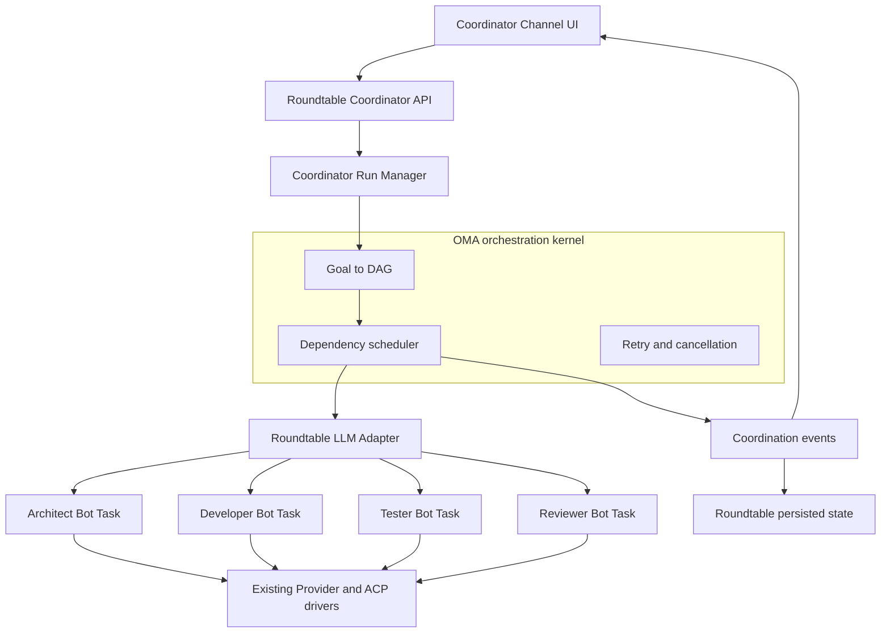
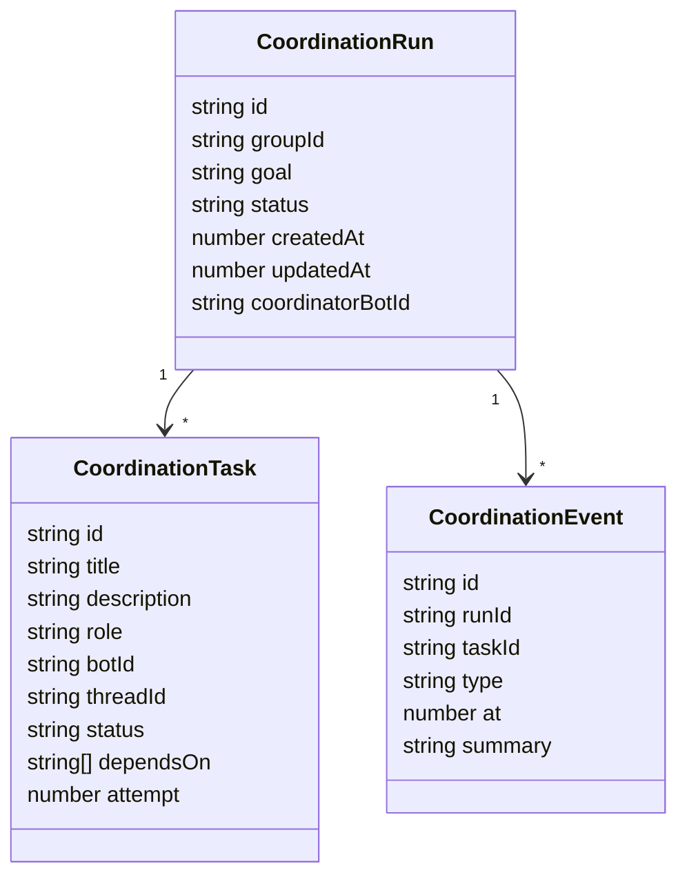

# Hackathon Coordinator MVP

Status: MVP implemented and build-verified  
Owner: Roundtable  
Reference runtime: Open Multi-Agent 1.17.0  
Last updated: 2026-09-01

## Outcome

Ship a Coordinator Channel that turns one human goal into a visible task DAG,
assigns Architect, Developer, Tester, and Reviewer bots, executes ready tasks in
parallel through Roundtable's existing provider drivers, creates fix tasks when
review fails, supports pause/retry/cancel, and publishes a final timeline report.

The MVP is complete when a user can start one coordination run from a channel,
watch its DAG change in real time, open every task's bot conversation, intervene
in the run, and read a durable final report after completion or cancellation.

## Architectural boundary

OMA owns planning, task dependencies, scheduling, retry semantics, and run-level
progress. Roundtable remains the only owner of bots, provider sessions, ACP,
permissions, workspaces, messages, and desktop UI state.



OMA must not launch a second ACP child for a Roundtable bot. The integration is
a custom OMA `LLMAdapter` whose `chat()` and `stream()` calls execute a normal
Roundtable bot turn and translate the settled reply into OMA response/events.

## User flow

1. A user creates or opens a normal Channel and enables Coordinator mode.
2. The channel validates that four active members can fill Architect,
   Developer, Tester, and Reviewer roles.
3. The user submits a goal from the Coordinator composer.
4. OMA asks the selected Coordinator/planning bot for a JSON task DAG.
5. Roundtable persists the run and renders the Mission Control panel.
6. Each ready OMA task creates a new task/thread on its assigned Roundtable bot.
7. Progress events update the DAG and timeline without polling.
8. Selecting a DAG node switches to that bot and exact task thread.
9. Reviewer output is parsed as APPROVED or CHANGES_REQUESTED. A rejection
   appends a fix task assigned to Developer, followed by another review task.
10. Pause stops new dispatches; running provider turns settle. Retry resets one
    failed task and its blocked descendants. Cancel interrupts active turns.
11. A terminal run appends a Markdown report to the Coordinator Channel.

## Persisted model

Coordinator state is stored separately from chat messages but references the
same group, bot, and thread identifiers.



Run status: `planning | running | paused | completed | failed | cancelled`.

Task status: `pending | ready | running | completed | failed | blocked |
cancelled`.

The first storage implementation is a crash-safe JSON file under the existing
Roundtable data directory. The file is written atomically and loaded with the
rest of server state. OMA checkpoints can replace or augment this after the MVP
executor is stable.

## API surface

- `POST /api/groups/:groupId/coordination`
  - Body: `{ goal: string }`
  - Creates one active run and starts planning in the background.
- `GET /api/groups/:groupId/coordination`
  - Returns the latest run, tasks, events, and available actions.
- `POST /api/groups/:groupId/coordination/pause`
- `POST /api/groups/:groupId/coordination/resume`
- `POST /api/groups/:groupId/coordination/cancel`
- `POST /api/groups/:groupId/coordination/retry`
  - Optional body: `{ taskId: string }`; the first version starts a new run
    carrying the failed task/error as retry context.

Coordination updates are added to the existing event stream as a typed
`coordination` frame. The renderer folds the frame into the selected Group.

## Role assignment

Role matching is deterministic and explainable:

1. Match normalized bot title/name/description against role aliases.
2. Prefer exact title and capability phrases over general description matches.
3. Do not assign one bot to multiple required roles unless fewer than four
   active channel members exist.
4. If the roster is incomplete, return a clear preflight error naming missing
   roles; do not silently create bots in the MVP.

Aliases:

- Architect: architect, architecture, design, planner, tech lead
- Developer: developer, engineer, builder, implementer, coder
- Tester: tester, test, QA, quality assurance
- Reviewer: reviewer, review, auditor, code review

The Coordinator planner is chosen from Architect first, then the channel's
configured lead, then the first active member.

## Reviewer and fix loop

The Reviewer receives the goal, DAG summaries, completed outputs, and explicit
instructions to end with one machine-readable verdict line:

```text
VERDICT: APPROVED
```

or:

```text
VERDICT: CHANGES_REQUESTED
FIX: <bounded corrective task>
```

On rejection, the run manager appends `FIX-n` assigned to Developer and
`REVIEW-n` assigned to Reviewer. The new review depends on the fix. Maximum fix
cycles for the MVP: two. Exceeding the limit ends the run as failed with a
report rather than looping indefinitely.

## Mission Control UI

The Coordinator Channel renders a panel above its transcript:

- Run status, goal, elapsed time, and completed/total count.
- Horizontal/vertical DAG depending on available width.
- Task cards with role, bot, status, duration, attempt, and dependency edges.
- Selected task detail with summary/error and `Open conversation` action.
- Run controls: Pause/Resume and Cancel.
- Failed-task action: Retry.
- Collapsible event timeline.
- Terminal report card linked to the full Markdown message.

The first DAG renderer uses native React/CSS/SVG so it adds no heavy graph
dependency. Layout is deterministic by dependency depth; nodes at the same
depth form a column and edges are SVG paths behind the cards.

## Delivery slices

### Slice 1: durable run skeleton

- Add OMA dependency.
- Add coordination domain types and atomic JSON repository.
- Add role matching with unit tests.
- Add start/status/control API routes.
- Emit typed coordination frames.

Acceptance: starting a run creates persisted planning state and the renderer
receives it after reload.

### Slice 2: OMA to Roundtable execution bridge

- Implement `RoundtableBotAdapter`.
- Create one bot task/thread per OMA task.
- Subscribe to existing runtime events for text, completion, usage, and errors.
- Map OMA progress into persisted task state and coordination frames.
- Wire AbortSignal to the existing provider interrupt path.

Acceptance: a fixed four-stage DAG runs Architect to Developer to Tester and
Reviewer through real Roundtable bots, with every task conversation openable.

### Slice 3: dynamic planning and review repair

- Use OMA `runTeam(..., { planOnly: true })` for Goal to DAG.
- Normalize/validate the generated DAG and guarantee the four required roles.
- Execute the frozen plan.
- Parse Reviewer verdict and append bounded fix/review tasks.

Acceptance: a rejected review visibly adds and executes a fix branch.

### Slice 4: Mission Control

- Add coordinator state to renderer Group shape and event fold.
- Build DAG layout, cards, task detail, controls, and timeline.
- Add exact bot/task navigation.
- Append and render the final report.

Acceptance: the complete workflow can be operated without opening developer
tools or reading server logs.

### Slice 5: verification

- Unit-test role matching, DAG validation/layout, state transitions, review
  verdict parsing, retry descendant reset, and report generation.
- Integration-test API start/pause/resume/retry/cancel against fake agents.
- Run focused Vitest tests, `pnpm typecheck`, `pnpm build`, and diff checks.
- Smoke the desktop workflow with fake providers before a real-provider run.

## Explicit MVP limits

- One active coordination run per Channel.
- Four required roles; no automatic Bot creation.
- No concurrent tasks assigned to the same Bot.
- Pause is drain-to-pause: it stops new dispatches but does not freeze a
  provider in the middle of a tool call.
- Retry operates at task boundaries.
- No Git worktrees or file reservations in this slice.
- No multi-user remote control plane.
- OMA token/cost accounting is best effort because several ACP providers do
  not report cost or complete token usage.

## Follow-up backlog

- OMA checkpoint restore and run journal replay.
- Editable plan preview before execution.
- Live DAG rewiring and reassignment.
- Worktree isolation and integration tasks.
- Multi-judge consensus.
- Historical Bot scorecards and model routing.
- Reusable Coordination Recipes.

## Progress log

- 2026-09-01: Repository and OMA 1.17.0 architecture inspected. Chosen design:
  custom OMA `LLMAdapter` backed by existing Roundtable Bot turns; no duplicate
  ACP runtime.
- 2026-09-01: Implemented persisted Coordinator runs, dynamic OMA plan-only
  decomposition with a deterministic fallback DAG, four-role binding, normal
  Roundtable task execution, real-time event frames, pause/resume/cancel/retry,
  two-cycle reviewer repair, and Markdown timeline reports.
- 2026-09-01: Implemented Coordinator Channel Mission Control with native SVG
  DAG edges, live task states, role roster, controls, and exact Bot task
  navigation.
- 2026-09-01: Verification complete for the Coordinator scope: 11 focused tests,
  TypeScript typecheck, renderer production build, packaged server bundle, new
  file lint, and diff checks pass. The repository-wide suite reports 1,303
  passing tests and three unrelated TTS failures; its health assertion also
  expects a pre-existing `static: true` field that the current health route does
  not return.
