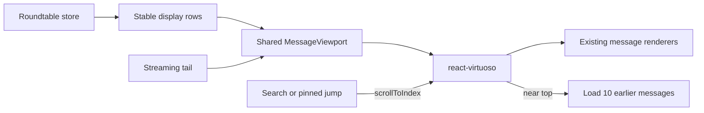

# Message Virtualization Migration Plan

## Goal

Replace Roundtable's hand-written transcript windowing and scroll-position state
with the MIT-licensed `react-virtuoso` list engine while preserving Roundtable's
message model, renderers, pagination API, branching, approvals, tool activity,
Coordinator delivery, and Composer.

## Non-goals

- Do not replace Roundtable's `Message` schema or provider/runtime state.
- Do not redesign message bubbles, Composer, Mission Control, or Coordinator UI.
- Do not adopt a hosted chat backend or a commercial message-list package.
- Do not change the server's latest-10 initial page size.

## Phases

### Phase 1 — Direct Agent Chat

- [x] Add `react-virtuoso` as a root dependency.
- [x] Add a shared `MessageViewport` that exclusively owns list scrolling.
- [x] Convert direct-chat messages into stable logical rows.
- [x] Load the existing 10-message history page when the viewport nears the top.
- [x] Use an initial `LAST/end` location so history never paints at the top.
- [x] Preserve position when earlier rows are prepended.
- [x] Integrate search/pinned-message jumps through `scrollToIndex`.
- [x] Keep bottom-follow active only while the reader remains at the bottom.
- [x] Stop replaying new-message animation for hydrated history.

### Phase 2 — Channel

- [x] Move Channel transcript rows onto the same `MessageViewport`.
- [x] Preserve sender clusters, Coordinator identity, questions, approvals,
      Mission Control placement, and delivery artifacts.
- [x] Remove the duplicate Channel scroll/follow implementation.

### Phase 3 — Cleanup and hardening

- [x] Delete `transcript-window.ts` and its tests after both consumers migrate.
- [x] Remove manual `scrollHeight` compensation, wheel/touch intent tracking,
      top sentinels, and `[overflow-anchor:none]` from both views.
- [ ] Add browser/Electron coverage for initial load, prepend anchoring,
      streaming while at bottom, streaming while reading history, search jumps,
      thread switches, images, Markdown/code, Mermaid, and expanded tool runs.
- [ ] Measure representative-history Electron cold start and scroll behavior.

## Acceptance criteria

1. The latest 10 messages first paint at the bottom without a visible jump.
2. Loading an earlier page keeps the previously visible message anchored.
3. Streaming follows at the bottom and never steals the viewport after the
   reader scrolls upward.
4. Dynamic-height content does not produce persistent position drift.
5. Search, pinned jumps, branch switching, approvals, and tool cards work.
6. Direct Chat and Channel share one scroll implementation after Phase 2.

## Rollback boundary

Keep the server pagination and message renderers unchanged. Phase 1 is isolated
to Direct Chat and Phase 2 to Channel; either viewport adapter can be reverted
without changing stored data or the transport protocol.
