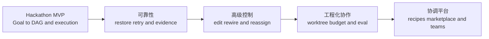
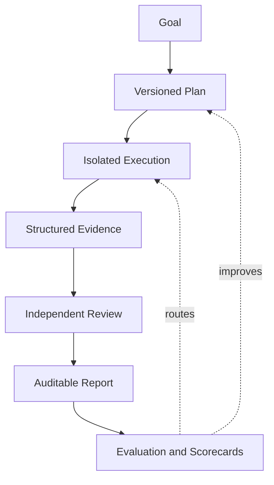

# Roundtable Coordinator Roadmap

更新时间：2026-09-01  
当前阶段：Hackathon MVP 已实现并完成构建验证

## 产品方向

Roundtable Coordinator 的目标不是再造一套 Agent Runtime，而是在
Roundtable 已有的 Bot、ACP Provider、工具权限、会话和桌面体验之上，增加一个
可靠、可观察、可干预的多 Agent 协作控制面。

OMA 负责 Goal 分解、DAG 和依赖调度；Roundtable 始终负责真正的 Bot 执行、
Provider session、审批、工具、工作目录、消息和 UI 状态。

## 已完成功能

### Coordinator Channel

- 普通 Channel 顶部提供 Coordinator 入口，无需创建另一种聊天室。
- 输入一个自然语言 Goal 即可启动协调任务。
- 同一 Channel 同时只允许一个活动 Run，避免执行状态互相污染。
- 至少需要四个 Bot；MVP 不会未经用户同意自动创建 Bot。

### Goal → DAG

- 接入 `@open-multi-agent/core` 1.17.0。
- 使用 OMA `planOnly` 将 Goal 动态分解成任务 DAG。
- 对生成计划进行角色、依赖和终态 Review 规范化。
- 动态规划失败时降级到 Architect → Developer → Tester → Reviewer
  四阶段 DAG，不让一次格式错误直接摧毁 Demo。

### 自动角色分工

- 自动绑定 Architect、Developer、Tester、Reviewer。
- 根据 Bot 的名称、Title 和 Description 做确定性匹配。
- 同一个 Bot 不会同时占用两个必需角色。
- Architect 同时承担第一版 Coordinator Planner 职责。

### Roundtable 执行桥

- 实现 OMA `LLMAdapter` 到 Roundtable Bot turn 的桥接。
- 每个 DAG Task 创建一个真实、独立的 Bot Task/thread。
- 沿用现有 Provider/ACP runtime、工具审批、凭据隔离和 transcript。
- 不会为同一个 Roundtable Bot 额外启动第二套 ACP runtime。
- 将 Bot 文本、完成状态、usage 和错误折叠回 Coordinator Run。

### 实时 Mission Control

- 在 Channel 中实时显示 Goal、Run 状态、耗时和完成进度。
- 使用原生 React/CSS/SVG 绘制 DAG 卡片和依赖边。
- 展示每个 Task 的角色、Bot、状态、Fix cycle 和最新事件。
- Coordinator 状态通过现有实时事件流推送，无需 UI 轮询。

### Task 对话跳转

- 已开始执行的 DAG 节点会关联具体 `botId` 和 `threadId`。
- 点击节点可以切换到对应 Bot 的准确 Task 对话。
- 用户可在真实 transcript 中检查工具行为、审批请求和执行证据。

### Reviewer 自动修复闭环

- Reviewer 必须输出机器可读 Verdict：
  `VERDICT: APPROVED` 或 `VERDICT: CHANGES_REQUESTED`。
- Reviewer 否决后自动追加 Developer Fix → Tester Verify → Reviewer
  Re-review 分支。
- 最多执行两个 Fix cycle，防止无限自我修复循环。

### 人工控制

- Pause：停止分发新 Task，正在执行的 Bot 允许安全结束当前 Task。
- Resume：继续分发已经 Ready 的 DAG Task。
- Cancel：中止 Run，并通过现有 Provider interrupt 路径停止活动 turn。
- Retry：当前版本从失败 Run 创建一个带失败上下文的新 Run；精确的
  单节点重试和后代复位仍在近期 Roadmap 中。

### 持久化与最终报告

- Coordinator Run、Task 和 Event 写入独立 JSON 文件。
- 使用原子文件替换，避免崩溃时产生半截 JSON。
- 重启时不会把中断的 Run 假装成仍在运行，而是标记为可诊断的失败状态。
- Run 结束后向原 Coordinator Channel 写入 Markdown 报告。
- 报告包括目标、总耗时、Fix 次数、任务结果和执行时间线。

### 当前验证状态

- Coordinator domain、OMA 执行桥、Reviewer Fix loop、Pause 和 DAG layout：
  11 个专项测试通过。
- TypeScript typecheck 通过。
- Renderer production build 通过。
- Packaged server bundle 通过。
- 新增文件 lint 与 diff 检查通过。
- 仍需在四个真实 Provider Bot 上完成一次完整的桌面端演练。
- 全仓现有测试还存在与 Coordinator 无关的 TTS 失败，以及 health 测试与
  当前 `/api/health` 返回结构不一致的问题。

## 近期：把 Hackathon Demo 做稳

### P0.1 真实 Provider 端到端演练

- 用 Architect、Developer、Tester、Reviewer 四个真实 Bot 完成一个小型代码任务。
- 覆盖工具审批、长输出、失败 turn、Reviewer 否决和 Cancel。
- 保存一份可重复演示的 Goal、项目样例和预期时间线。

完成标准：连续运行三次均能生成 DAG、完成任务跳转，并输出终态报告。

### P0.2 精确 Task Retry

- 支持从失败节点单独重试。
- 自动计算并复位该节点的 blocked descendants。
- 保留已经成功的上游结果，不重新消耗它们。
- 在时间线里明确记录 retry attempt 和继承的输入证据。

完成标准：一个中间 Task 失败后，只重跑必要子图，最终报告保留两次 attempt。

### P0.3 Crash-safe Resume

- 接入 OMA Checkpoint 和 Run Journal。
- 重启后恢复 completed Task、pending DAG 和共享记忆。
- 对重启时仍在执行的 Provider turn 做明确 reconciliation，不能重复提交
  可能产生副作用的操作。

完成标准：在任意 Task 边界关闭 Roundtable，重启后可从安全边界继续。

### P0.4 Coordinator API 集成测试

- 覆盖 start、hydrate、pause、resume、cancel、retry 和实时 event frame。
- 使用 fake Provider 验证 Bot task/thread 创建和跳转目标。
- 修复当前仓库的 TTS 与 health 测试基线，恢复全绿信号。

## 下一阶段：让协调过程真正可控

### P1.1 Plan Preview 与人工批准

- Goal 生成 DAG 后先进入 Preview，而不是立即执行。
- 支持编辑 Task 标题、描述、依赖和 Acceptance Criteria。
- 提供 Approve Plan、Regenerate 和 Cancel。
- 对高风险 Goal 默认要求人工批准计划。

### P1.2 Live DAG Rewire

- Run 执行中新增、删除或替换尚未开始的 Task。
- 修改依赖时进行环检测和影响预览。
- 已完成节点保持不可变 receipt，变更以新的 Plan Revision 记录。

### P1.3 手动 Reassign 与动态角色

- 点击 Task 可重新选择 Bot。
- 从固定四角色扩展到 Researcher、Product、Security、UX、Data 等角色。
- 区分逻辑 Role 和实际 Bot，保留为什么选择该 Bot 的解释。
- Bot 不可用时建议替代者，而不是静默改派。

### P1.4 更完整的 Task Detail

- 展示输入、依赖摘要、输出、错误、attempt、tokens、cost 和耗时。
- 从 DAG 节点直接打开 transcript、文件 diff、测试结果和审批记录。
- 支持按 Critical Path、失败、活动 Bot 过滤 Mission Control。

### P1.5 Structured Artifacts

- Task 不只返回自然语言，还可以产出规范化 Artifact：Architecture Decision、
  Patch、Test Evidence、Review Verdict、Release Note。
- 下游 Task 依赖 Artifact schema，而不是依赖长文本猜测。
- 最终报告链接到所有 Artifact 和代码变更。

## 中期：面向真实软件工程

### P2.1 Git Worktree 与文件隔离

- 为并行 Developer Task 创建独立 worktree。
- 增加文件 reservation，提前发现两个 Agent 修改同一文件的冲突。
- 设置 Integration Task 合并并验证多个分支。
- 所有删除、覆盖和 merge 保持可审计、可恢复。

### P2.2 Acceptance Criteria 驱动

- Architect 为每个 Task 输出可验证 Acceptance Criteria。
- Tester 将 Criteria 映射为具体 test/evidence。
- Reviewer 根据 Criteria 和证据裁决，而不是仅凭一段总结。
- 没有证据的“完成”不能进入 completed 状态。

### P2.3 Multi-reviewer Consensus

- 对 Security、Architecture、Correctness 使用独立 Reviewer。
- 支持 quorum、refutation 和 dissent report。
- 高风险任务要求职责隔离：实现者不能同时成为最终 Reviewer。

### P2.4 Budget 与 Model Routing

- 为 Run 设置 token、cost、wall-clock 和并发预算。
- 根据 Task 类型、风险、历史表现选择 Provider/model。
- 预算不足时降级模型、缩小并发或请求人工决策，而不是静默牺牲 Review。
- Mission Control 显示预计与实际消耗。

### P2.5 可观察性与评测

- 记录 DAG critical path、排队时间、执行时间、重试率和 Reviewer 通过率。
- 建立 Coordinator eval cases：计划质量、依赖正确性、角色选择和修复效果。
- 为 Bot 生成基于真实运行的 scorecard，不依赖自我描述。
- 比较不同 OMA 策略、角色组合和模型路由的质量/成本。

## 长期：Coordinator Platform

### P3.1 Coordination Recipes

- 保存可复用的 DAG 模板，例如 Feature Delivery、Bug Triage、Security Audit、
  Release Readiness、Research Report。
- Recipe 包含角色、任务 schema、审批点、预算和报告模板。
- 支持从成功 Run 提炼 Recipe，但必须由用户确认后才能保存。

### P3.2 Simulation 与 What-if

- 执行前估算 critical path、成本、并发和潜在冲突。
- 比较“更快”“更便宜”“更严格 Review”等策略。
- 对 DAG 修改显示预计影响，而不是只能运行后观察。

### P3.3 Human + Agent Collaboration

- 人可以领取 DAG Task，提交证据后重新进入依赖图。
- 支持明确的 Approval Gate、Escalation 和 SLA。
- 多人协作时增加权限、身份、操作日志和冲突处理。

### P3.4 Connector-aware Coordination

- 将 GitHub issue/PR、设计稿、文档、任务系统作为受权限控制的 Artifact 来源。
- 外部写操作必须经过现有连接器权限和人类批准。
- Coordinator 只负责规划调用，不能绕过 Roundtable 的凭据和授权边界。

### P3.5 Recipe 与 Agent 生态

- 可分享 Agent Profile、Role Pack、Eval Set 和 Coordination Recipe。
- 导入内容默认无权限，不自动获得文件、工具或 Connected App 访问。
- 提供版本、来源、签名、兼容性和安全审查信息。

## 建议优先顺序

| 优先级 | 能力 | 原因 |
| --- | --- | --- |
| P0 | 真实 Provider 演练 | Hackathon Demo 成败首先取决于端到端稳定性 |
| P0 | 精确 Task Retry | 当前重跑整个失败 Run，成本和反馈速度都不理想 |
| P0 | Checkpoint/Resume | 长任务必须能承受应用重启和 Provider 中断 |
| P1 | Plan Preview | 是从“自动运行 Demo”走向“可信控制面”的关键一步 |
| P1 | Structured Artifacts | 显著减少 Agent 之间靠长文本传递产生的信息损失 |
| P2 | Worktree 隔离 | 真正并行修改代码之前必须先解决写冲突与集成问题 |
| P2 | Acceptance Evidence | 让 completed 从语言声明升级为可验证事实 |
| P2 | Budget/Model Routing | 使系统能够长期运行，而不仅是一次成功演示 |
| P3 | Recipes 与生态 | 在运行内核稳定后再扩大复用和分享范围 |

## 明确不应过早做的事情

- 不为了“通用”而绕开现有 Roundtable Provider/ACP 边界。
- 不在没有 worktree/file reservation 前并行修改同一工作目录的大量文件。
- 不把 LLM 的 `APPROVED` 当成安全或策略的最终权威；Runtime 和用户审批仍然有效。
- 不在缺少真实指标前建立复杂的自动模型路由。
- 不在导入 Agent/Recipe 时自动授予工具、凭据或 Connected App 权限。

更详细的 MVP 架构、数据模型、API 和交付记录见
[`docs/plans/hackathon-coordinator-mvp.md`](docs/plans/hackathon-coordinator-mvp.md)。
